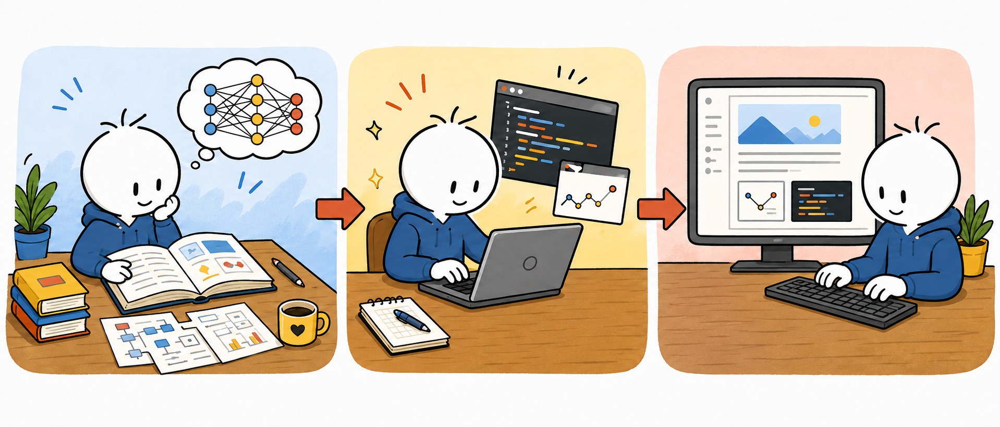
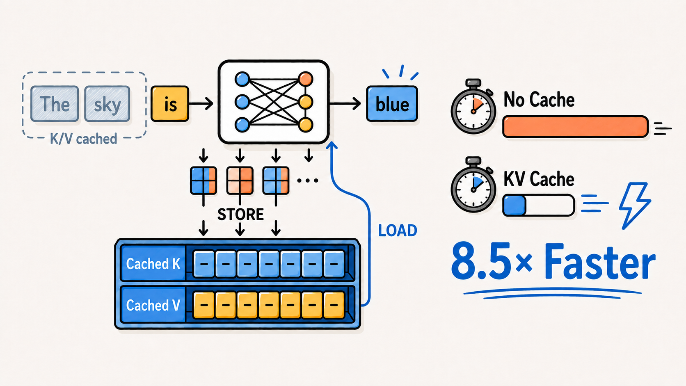
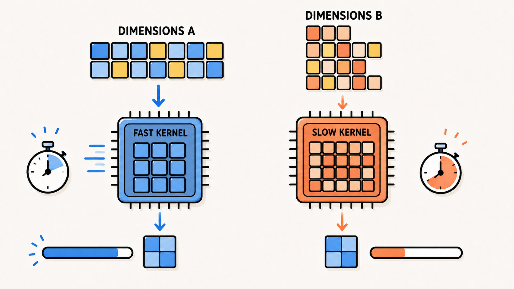
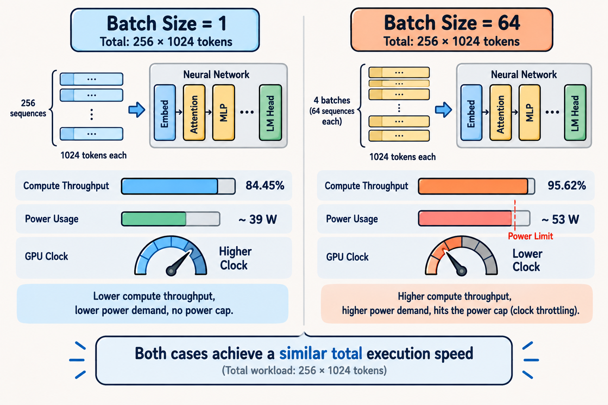

# About This Blog

This blog is a personal record of what I learn, implement, and investigate while studying deep learning. It's meant to be a place I can come back to and review whenever I forget what I've studied. Each post reflects my understanding at the time of writing and may contain incomplete interpretations or technical errors. I try to verify what I learn through implementation, experiments, and primary sources, and I revise posts when I discover mistakes or develop a better understanding.

These posts are intended as learning notes rather than authoritative technical documentation. I'm also not a native English speaker, so the writing may contain grammatical errors. Constructive feedback and corrections are always welcome.

[See all posts →](/posts/)

# What I'm doing here
This blog is organized around two axes:

1. **Understanding the modern LLM stack** ([`Fundamentals`](/categories/fundamentals/)) — study based on [`nanochat`](https://github.com/karpathy/nanochat), examining how recent LLMs are put together end-to-end: what modules they're composed of, what techniques they rely on, what the data processing pipeline looks like, how training is done, and what the data formats are.
2. **Implementing and analyzing deep learning techniques** ([`Experiments`](/categories/experiments/)) — experiments based on [`nanoGPT`](https://github.com/karpathy/nanoGPT), taking a simple, lightweight GPT and directly implementing and experimenting with deep learning techniques myself.

# Hands-on Experiments

Posts here are listed in descending order of importance. 
Most of the experiment code is in <a href="https://github.com/winterstar67/AI-Experiments">https://github.com/winterstar67/AI-Experiments</a>

## KV Cache Analysis {#kv-cache-analysis}
[See post →](/posts/kv-cache-implementation/)

- Question:
	- How much does the KV cache reduce the inference time?
	- Does it achieve a 1023x speedup of the attention operation at T=1023?
- Result:
	- The implementation is verified to be correct.
	- KV cache achieved an approximately 8.5× end-to-end speedup.
	- The QKᵀ matmul was approximately 93× faster at T=1023.
- Finding: KV cache increased the speed substantially, but the inefficiency of GEMV, which is memory-bandwidth-bound, causes a lower speedup than expected.

## Kernel Investigation {#kernel-investigation}
[See post →](/posts/kernel-investigation/)

- Question: Do batch size and token length change kernel selection?
- Result: In the test, the vocab size padding changed kernel selection while batch size and token length didn't.
- Finding: Kernel selection was sensitive to the alignment of a particular GEMM dimension rather than to every tensor dimension.

## A Larger Batch Size Doesn't Always Increase Inference Speed {#batch-size-inference-speed}
[See post →](/posts/a-larger-batch-size-does-not-always-increase-inference-speed/)

- Question: Why isn't inference at batch size B=64 faster than at B=1?
- Result: B=64 hit the power limit, causing clock throttling.
- Finding: Compute/memory throughput isn't the only factor in inference efficiency — power-cap-driven clock throttling also needs to be monitored.

[Other Hands-on Experiments](/categories/experiments/)

# Contact
<!-- 남기고 싶은 것만 두고 나머지 줄은 삭제 -->
- GitHub: [winterstar67](https://github.com/winterstar67)
- Email: [winterstar677@gmail.com](mailto:winterstar677@gmail.com)
