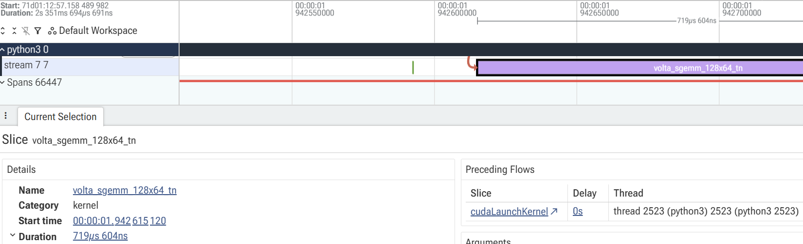
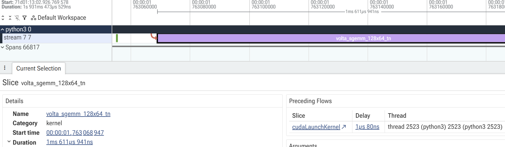
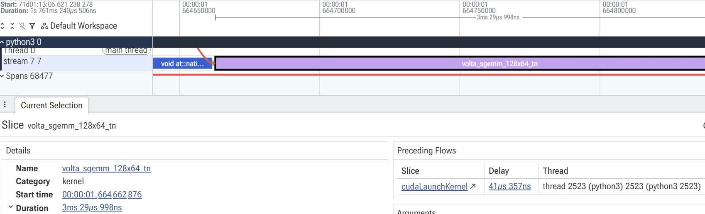
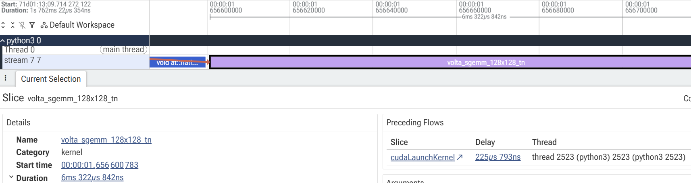
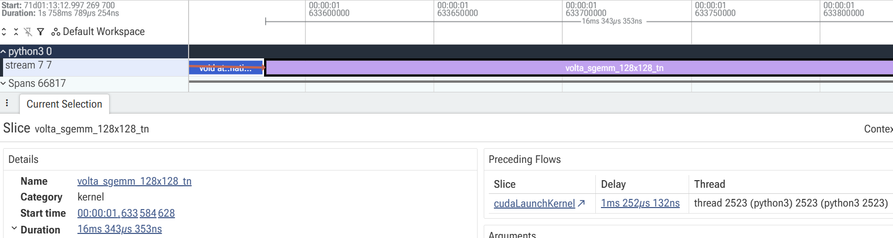
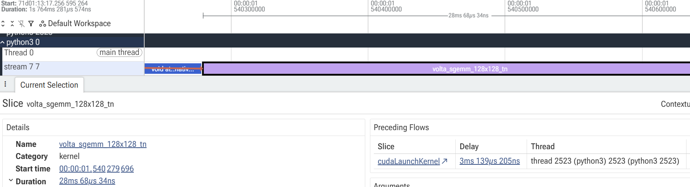
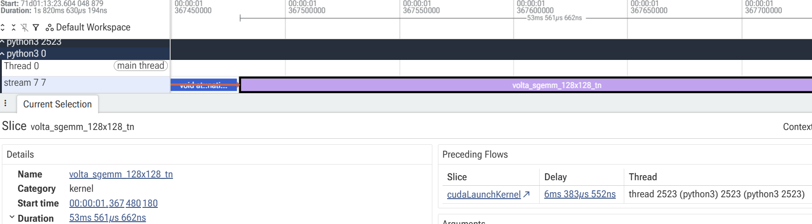

**This experiment was conducted using Claude code because I'm not familiar with ncu**

All code and experiments are on [GitHub](https://github.com/winterstar67/AI-Experiments/tree/main/Batch%20Size%20vs%20Inference%20Speed)

# 1. Motivation
I was quantizing each layer sequentially (GPTQ). But it took so long. Because I was using Colab's free version, taking more than 2 mins in every layer was too risky for me.
I expected that the inference time would increase linearly as I increase the batch size. So I tried to increase the batch size as much as Colab could hold. But it didn't. In every layer, the quantization showed a similar execution time.

Usually, a faster inference speed is expected at a larger batch size because:
- A more efficient kernel selection
- A more efficient tile-size selection for GEMM kernels
- Less launch overhead

But I experienced a totally opposite result from what I thought.

# 2. Hypothesis
A larger batch size would increase the inference speed linearly.

# 3. Settings
Because there are a lot of kernels in one nanoGPT inference, I fixed the QKV projection layer in the first block at the last batch forward for this investigation.

**GPU: NVIDIA Tesla T4 (Turing, compute capability 7.5)**
- CUDA cores: 2,560 / Tensor Cores: 320 (2nd-gen Turing)
- Memory: 16GB GDDR6, 320 GB/s bandwidth
- Boost clock: 1,590 MHz (confirmed via `clocks.max.sm`)
- **Power limit: 70W** — this is the key spec for this investigation, since T4 is a bus-powered card (no external power connector, PCIe slot power only), so it has a much tighter power budget than most datacenter GPUs
- FP32: 8.1 TFLOPS

**Runtime settings**
- total test token size: `256*1024`
- dtype: float32
- batch size ranges: 1, 2, 4, 8, 16, 32, 64
- token_size per row: 1024
- warmup: 10
- seed: 1337
- device: "cuda"
- torch.backends.cuda.matmul.allow_tf32: False
- torch.backends.cudnn.allow_tf32: False
- torch.use_deterministic_algorithms: True

# 4. Experiment process
## 4-1. Naively compare in each batch
I ran nanoGPT in B=1, 2, 4, 8, and 16 cases. Because there could be GPU overheating, I also tested it in the reversed order: B=16, 8, 4, 2, and 1.

Now, I can infer that the speed of model inference didn't increase as batch increases.

Wall time and kernel time were estimated five times. The numbers below are the mean and std.
$$
\begin{array}{r|r|r}
\text{Batch} & \text{Wall time (ms)} & \text{Kernel time (ms)} & \text{Rank} \\
\hline
4 & 26,359 ± 127 & 1,670 ±  8 & 1 \\
8 & 26,542 ± 319 & 1,674 ± 20 & 2 \\
1 & 26,728 ±  15 & 1,647 ±  1 & 3 \\
16 & 26,784 ±  21 & 1,693 ±  1 & 4\\
2 & 27,092 ±  20 & 1,658 ±  1 & 5 \\
\end{array}
$$
- Each test was repeated five times in total.
- I didn't test B=32 and 64 because of OOM in the whole model inference.

What I expected was that a larger batch results in faster speed. But it shows that B=4 is the fastest and B=2 is the slowest. It's the opposite of what I thought and hard to find a pattern.

## 4-2. QKV proj kernel comparison
Because checking every kernel in nanoGPT inference is too many, I selected QKV kernel of the first block at the last batch forward to investigate.

I checked the kernel duration results and memory/compute throughput.
- Kernel time: torch.profiler + Perfetto UI used
- Memory/Compute Throughput: ncu command used
- **The results are obtained by running code twice (torch.profiler and ncu command)**.
	- The table below uses `torch.profiler`'s Kernel time.

### 4-2-1. Kernel results
$$
\begin{array}{r|r|r|r}
\text{Batch} & \text{Kernel time (torch.profiler)} & \text{Memory Throughput (ncu)} & \text{Compute Throughput (ncu)}\\
\hline
1 & 719 \mu \text{s} & 44.48\% & 84.45\%\\
2 & 1\text{ms } 611\mu \text{s} & 46.17\% & 87.66\%\\
4 & 3\text{ms } 29 \mu \text{s} & 46.08\% & 90.52\%\\
8 & 6\text{ms } 322 \mu \text{s} & 40.21\% & 94.58\%\\
16 & 16\text{ms } 343 \mu \text{s} & 40.29\% & 94.73\%\\
32 & 28\text{ms } 68 \mu \text{s} & 40.49\% & 95.21\%\\
64 & 53\text{ms } 561\mu \text{s} & 40.67\% & 95.62\%\\
\end{array}
$$

**Normalized results (per data)**
$$
\begin{array}{r|r|r|r|r|r}
\text{Batch} & \text{Kernel time (torch.profiler)} & \text{scale} & \text{Rank} & \text{Memory Throughput (ncu)} & \text{Compute Throughput (ncu)} \\
\hline
1 & 719.00\ \mu\text{s} & \times 1 & 1 & 44.48\% & 84.45\% \\
4 & 757.25\ \mu\text{s} & \times 1/4 & 2 & 46.08\% & 90.52\% \\
8 & 790.25\ \mu\text{s} & \times 1/8 & 3 & 40.21\% & 94.58\% \\
2 & 805.50\ \mu\text{s} & \times 1/2 & 4 & 46.17\% & 87.66\% \\
64 & 836.89\ \mu\text{s} & \times 1/64 & 5 & 40.67\% & 95.62\% \\
32 & 877.13\ \mu\text{s} & \times 1/32 & 6 & 40.49\% & 95.21\% \\
16 & 1021.44\ \mu\text{s} & \times 1/16 & 7 & 40.29\% & 94.73\% \\
\end{array}
$$

The results directly indicate that the single kernel doesn't scale efficiently with batch size.

## 4-3. Why the larger one shows a slower speed (clock limitation)
It is quite weird that even though the compute throughput and batch size has increased, the inference speed still didn't increased.
The unchanged speed is caused by the **clock limitation**.
**Clock** determines execution speed of the GPU while the compute throughput means the efficiency.
I got two evidences that the clock gets throttled down.
1. `clocks_event_reasons.sw_power_cap: Active` means the clock is limited by the GPU hitting the power cap
	- But there wasn't `sw_thermal_slowdown:Active` warning.
2. Clock-fixed experiments show that the speed increases as the batch size increases at the low clock.

I fixed clock to be low while T4's maximum clock is 1590 MHz and I estimated forward time.
### 4-3-1. Clock throttling check
**Aggregated across the whole sweep:**
$$
\begin{array}{l|r|r|r}
\text{Fixed clock} & \text{\% samples at target} & \text{sw\_power\_cap Active} & \text{sw\_thermal\_slowdown Active} \\
\hline
585\text{ MHz} & 98.4\% & 3.7\% & 0\% \\
900\text{ MHz} & 51.1\% & 53.8\% & 0\% \\
\end{array}
$$

**Broken down per batch_size** (logged separately per batch, so the lock quality at each batch_size can be checked on its own instead of averaged away):

$$
\begin{array}{r|r|r|r|r}
\text{Batch} & \text{\% at 585MHz} & \text{sw\_power\_cap Active} & \text{sw\_thermal\_slowdown Active} & \text{avg power (W)} \\
\hline
1  & 100.0\% & 0.0\% & 0.0\% & 28.85 \\
2  & 100.0\% & 0.0\% & 0.0\% & 32.05 \\
4  & 100.0\% & 0.0\% & 0.0\% & 34.96 \\
8  & 100.0\% & 0.0\% & 0.0\% & 37.16 \\
16 & 100.0\% & 0.0\% & 0.0\% & 40.01 \\
32 & 100.0\% & 0.0\% & 0.0\% & 42.50 \\
64 & 100.0\% & 0.0\% & 0.0\% & 47.24 \\
\end{array}
$$
- I'm not sure when the $\text{sw\_power\_cap Active} = 3.7\%$ in aggregated case happened.
- All broken down per batch size cases show $0\%$.

$$
\begin{array}{r|r|r|r|r}
\text{Batch} & \text{\% at 900MHz} & \text{sw\_power\_cap Active} & \text{sw\_thermal\_slowdown Active} & \text{avg power (W)} \\
\hline
1  & 100.0\% & 0.0\% & 0.0\% & 39.29 \\
2  & 100.0\% & 0.0\% & 0.0\% & 41.19 \\
4  & 100.0\% & 0.0\% & 0.0\% & 41.76 \\
8  & 93.2\% & 17.9\% & 0.0\% & 44.67 \\
16 & 85.5\% & 46.6\% & 0.0\% & 46.68 \\
32 & 79.7\% & 52.5\% & 0.0\% & 47.79 \\
64 & 62.4\% & 60.0\% & 0.0\% & 53.02 \\
\end{array}
$$
The results shows that the clock becomes slow down by the power cap, not temperature limit.
- 585 MHz case mostly keep the 585 value.
- 900 MHz case failed to keep 900 value on the larger batch size. Clock throttling happened at more than half of points.
- **This explains why B=1 looked faster than B=64 under free/unlocked clock**

**585 MHz clock number was selected for the fixed-clock experiment.**

### 4-3-2. Clock fix experiments
#### 4-3-2-1. 585 MHz, clock-fixed case
The result below is the estimation of the inference speed of `QKV_PROJ` in block 0 fixing the clock to **585 MHz**.
$$
\begin{array}{r|r|r}
\text{Batch} & \text{QKV\_PROJ raw (ms/call)} & \text{Normalized (÷B, ms)} \\
\hline
1 & 1.633 & 1.633\ (\times 1) \\
2 & 2.983 & 1.4915\ (\times 1/2) \\
4 & 5.407 & 1.3518\ (\times 1/4) \\
8 & 10.266 & 1.2833\ (\times 1/8) \\
16 & 20.487 & 1.2804\ (\times 1/16) \\
32 & 40.792 & 1.2748\ (\times 1/32) \\
64 & 81.206 & 1.2688\ (\times 1/64) \\
\end{array}
$$
- *Mean over 5 repeats*

**The 585 MHz case show that the larger batch size speeds up inference more than the smaller ones**
- I guess that the reason `B=32` is similar to `B=64` is that both are already compute-bound

## 4-4. Does this hold for the whole model, not just block0?
I run the whole model fixing the clock to **585 MHz** and got the results below
$$
\begin{array}{r|r|r}
\text{Batch} & \text{Raw (ms/call)} & \text{Normalized (÷B, ms)} \\
\hline
1 & 141.576 & 141.576\ (\times 1) \\
2 & 282.105 & 141.053\ (\times 1/2) \\
4 & 547.478 & 136.870\ (\times 1/4) \\
8 & 1{,}085.790 & 135.724\ (\times 1/8) \\
16 & 2{,}160.455 & 135.028\ (\times 1/16) \\
\end{array}
$$

- *Mean over 5 repeats*

The clock investigation shows that **the clock is the culprit of inefficiency of a larger batch size**

# 5. Conclusion
We should consider that the following two components affect the inference speed
1. Memory/Compute bound
2. Clock limitation (Power limitation)

Even if the kernel (Algorithm) is efficient, the inference could be slow due to the resource (Hardware).
Especially in the resource-limited environment, investigating various conditions before fixing the runtime setting is important.
## 5-1. How to solve this
In this situation, to get the speed up effect by increasing batch size, the compute bound and clock throttling problems should be resolved.
1. Clock throttling by the power cap
	- Choosing more effective kernel
	- Decreasing dtype
	- Use a GPU that has a larger power cap
2. Compute bound
	- Choosing more effective kernel
	- Decreasing dtype

# Appendix
## A. Perfetto UI results
### Batch 1

### Batch 2

### Batch 4

### Batch 8

### Batch 16

### Batch 32

### Batch 64

