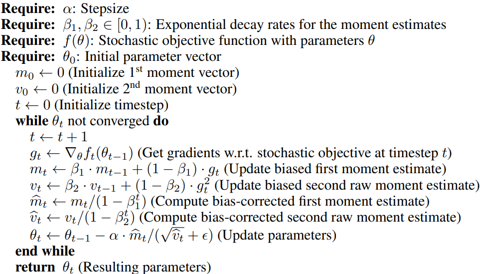

# Paper info
- **Title**: *ADAM: A METHOD FOR STOCHASTIC OPTIMIZATION*
- **Authors**: Diederik P. Kingma, and Jimmy Lei Ba
- **URL** : https://arxiv.org/pdf/1412.6980
- **Length**: 15 pages
	- REFERENCES: 2 pages
	- APPENDIX: 4 pages

# 0. Background Knowledge to know
## 0-1. Statistics
- $Var(x) = E[x^2] - E[x]^2$
- $(\sqrt{v = E[x^2] = Var(x)+E[x]^2}) >= (m=|E[x]|=\sqrt{E[x]^2})$
	- m is not pure scale mean it's just sum every sample and take division with n. in the sample of $[1,-1,1,-1]$, the mean is 0
	- v is pure scale mean - Kinda scale indicator that's consist of Variance and squared mean. It convert every same value in to positive and make mean of them - in the sample of $[1,-1,1,-1]$, the RMS is 1
- If the $E[g^2]$ is large but if the mean is small, then that could be one of sign of unstable gradient now.
## 0-2. For the historical traces in optimization, knowing Adagrad and RMSProp seems good

## 0-3. Exponential Moving Average (EMA)
- Interpreting EMA in half life view
- EMA is same with linear interpolation - we can utilize this when implementing Adam
- Reflecting recent sample on the mean - It's good to representing non-stationary distribution
	- So in RMSProp and Adam, they use moving average to drop the old gradient
		- Also the gradient value $g_t$ distribution is non-stationary by the time step t. So reflecting recent gradient on the update value with more weight is natural

# 1. Motivation
The SGD is a fundamental method for gradient based optimization that shows many of success on the Deep learning. But the SGD has the same scale of learning rate in every parameter. So to handle this fixed lr phenomenon, many of gradient methods come out such as AdaGrad and RMSProp
- AdaGrad: It's for sparse gradient. $G_t​= \sum_{i=1}^t{​g_i​\otimes g_i}​$, $\theta_{t+1} = \theta_t - \eta \cdot \frac{g_t}{\sqrt{G_t + \epsilon}}$
	- The gradient vector: $[0.001, 0.001, 10]$ at step 1, $[0.001, 0.001, -5]$ at step 2. In here the spare (0 close) component would be added up
	- The 10 and -5 component would be added up on the $G_t$, just all historical gradients are stacked up. So it makes that part's update value to be almost 0 in fast
	- The 0.001 parts are still added up, and even at first, the small gradient can be amplified by the small $\sqrt{G_t}$ value. 
	- This helps to control the large gradient to be calm down, and the small gradient to be amplified.
	- Cons: There's no restriction on growing denominator value. If the training keep going infinitely, the $G_t$ would be grow up infinitely, so the update value would be almost 0.
- RMSProp: It limits the window size of history gradients with EMA compared to AdaGrad. $v_t​=\beta v_{t−1} ​ +(1−\beta)g_{t}^2$​, $\theta_{t+1} = \theta_t - \eta \cdot \frac{g_t}{\sqrt{v_t + \epsilon}}$
	- AdaGrad has an disadvantage that if the training step(epoch) proceed a lot, the $\sqrt{G_t}$ would be bigger and bigger. Then the $\frac{g_t}{\sqrt{G_t + \epsilon}}$ would become 0 for all gradient in every weight eventually.
	- RMSProp can relieve this phenomenon using recent gradient applying Exponential Moving Average(EMA)
	- The EMA has an effect of controlling how many steps' gradient to include in the mean, or half life of gradient? with $\beta$ parameter

Is the giving independent lr value per each parameter best?
- Well, does every parameter have to use same learning rate? Are we sure it's the best?
- We don't know. But at least, giving flexibility that each of parameter can have different lr value can cover the fixed learning rate case too.

Adam(Adaptive gradient method) replaced the $g_t$ with $m_t$, which means that the momentum replaces gradient in RMSProp
- I think the momentum is more stable than single gradient value with a similar reason of dividing with $\sqrt{G_t}$ in AdaGrad - get more speed on small gradient.

# 2. Explanation

## 2-1. Derivation
### Formula
$m_t = \beta_1*m_{t-1} + (1-\beta_1)*g_t$ is the definition of EMA
The expanded formula is $m_t = (1-\beta_1)*\sum_{i=1}^{t}{\beta_1^{t-i}*g_i} + \beta_1^t*m_0$
- We can check it has exponential weight decay and for the latest sample, it has the largest weight
- Why is there a ($1-\beta_1$)? It's normalization term to make the formula to be mean of sample - To be the "mean" formula, the sum of weight should be 1. 

### Bias
We suppose $m_0 = 0$. This is where the bias origin from. We don't know whether $m_0$ is 0, 0.1, -0.3, 3, or -2.1, etc.
- $m_0$ is not "mean of 0 sample". It's just a fixed starting point of recursive formula.

At first, the mean of gradients for a few steps is assumed to be similar, so $E[g_t] = \mu$ is acceptable.
- So the mean of this is $(1-\beta_1^t) \mu$, because we can set $E[m_t] = E[(1-\beta_1)*\sum_{i=1}^{t}{\beta_1^{t-i}*g_i}] = (1-\beta_1)*E[\sum_{i=1}^{t}{\beta_1^{t-i}}*g_i]$. In here, we supposed that $E[g_t] = \mu$. So the formula is continued to $(1-\beta_1)*\mu*\sum_{i=1}^{t}{\beta_1^{t-i}}$. Because $$\sum_{i=1}^{t}\beta_1^{t-i} = \sum_{k=0}^{t-1}\beta_1^k = \frac{1-\beta_1^t}{1-\beta_1}$$, the final result is $\mu * (1-\beta_1^t)$
	- $\beta_1^t*m_0$ in $m_t = (1-\beta_1)*\sum_{i=1}^{t}{\beta_1^{t-i}*g_i} + \beta_1^t*m_0$ was ignored because we supposed $m_0=0$
- The sum of all weights in EMA is 1.
- At step 1, the EMA is $m_1 = m_0*\beta_1 + (1-\beta_1)*\beta_1^0*g_1 = (1-\beta_1)*g_1$ 

We need two assumptions
- $g_t$ is stationary so that we can determine how much the estimator biased
- $1-\beta_1^t$ = 1 in large t to make the $m_t = (1-\beta_1)*\sum_{i=1}^{t}{\beta_1^{t-i}*g_i} + \beta_1^t*m_0$ be mean (Sum of weight should be 1)

The effect of $m_0$ would be vague if we keep proceeding training steps. Because 95% of added value is within recent 3000 steps, in that 3000 steps, the $m_0$ impact on total mean would be small
- In $\mu*(1-\beta_1^t)$, the bias is $(1-\beta_1^t)$. So, if the $t$ is large, then $\beta_1^t$ would be smaller so $\mu*(1-\beta_1^t) \approx \mu$, which means the denominator in bias correction ($\frac{1}{(1-\beta_1^t)}$) is almost 1, so almost no changes.
	- At step one, $(1-0.9) = 0.1$ . The impact is quite big.

## 2-2. The effects of Adam
We can expect the following stable update effects using Adam
- Automatically set the gradient step scale not too large.
	- For the unstable period(Large variance) of gradient, it reduce the update step to be small.
	- If the gradient itself is too large, the scale would be set into an appropriate level.
- Only include the certain steps of gradient to be accumulated. 
	- This is the advantage of RMSProp (EMA)
	- It reflect the recent gradients more strongly than the past ones
	- It would not infinitely accumulated with same weight mean. So it can prevent the 0 update phenomenon at last unlike the AdaGrad

Mean/std(error) is fraction of mean and std. So we can judge whether the error is large or not compared to the mean
1. We can consider the "scale" of gradient with mean/std format. Let's fix the std( sqrt(var) ) of gradient is 0.1, and let's think the mean of gradient with two cases: 
	- (1) 0.001: 0.1 std is too large for mean 0.001 scale. So, multiplying 0.001/0.1 = 0.01 on the update value means that this recent gradients are unstable so we scaled down the update value
	- (2) 10: 10/0.1 = 100 indicates that the fluctuation of recent gradient values is very small relative to the mean scale, it's super stable (Considering the scale of gradient mean, 0.1 is super small). So we multiply large value on the parameter update value.
	- As you can check, even for the same std value, the effect on the step size could be different in large (and vice versa for the same mean value and different std too)
	- If the recent std is large compared to the recent mean scale, scale down step size 
		- This means that we will not reflect this time step's gradient not too much update on the weight because the gradient is too unstable when we consider this time step's moment(gradient mean) scale

## 2-3. Question
Q1. Why is `m` divided by `sqrt(v)`?
- To check the instability(Variance) with no distortion of gradient(mean)
	- v is $E[g_{t}^2] = Var(g_t) + E[g_t]^2$ consisting of variance and squared mean
	- If the variance is large, we consider this as the gradient update is unstable, so we shrink the update step.
	- If the mean is large while the variance is small, then the numerator $m=E[g_t]$ and the denominator $\sqrt(v) \approx \sqrt{E[g_t]^2} =|E[g_t]|$, so both are canceled, and update scale can be kept in value 1, which is not that large value.
- Suppose that we don't use $E[g_{t}^2]$, but just use $Var(g_t)$, which means we drop $E[g_t]^2$.
	- Then here's the problem, let's suppose that mean is large while the variance is small, then the update value could be very large, because the update value could be $\frac{m_t}{0.001}$ in extreme case
	- But that doesn't mean we can have large step size, because still we don't know the Hessian. Just compared to the unstable situation, it's better. The step size could be amplified largely without limitation of range of amplifying value
- If Error term(Var term) is too large, we need to scale down because the state is unstable
- If the $E[x]^2$ is too large, we need to scale down because the scale is too large

Q2. aren't the m and v similar because $m=E[g]$ and $v=E[g^2]$  so $\frac{m}{\sqrt{v}} \approx 1$ ?
- There are big difference in $m$ and $\sqrt{v}$
	1. $\sqrt{v}$ is always equal to or larger than $m$
	2. $\sqrt{v}$ convert negative sample into positive sample and do squared sum with divided by n followed by squared root while m just added up samples and divide with n
		- So $\sqrt{v}$ just purely measure the scale of the magnitude while m can cancelate the value when there's negative number

# 3. Methodology
## 3-1. Algorithm
### The input parameter
- $t$: timestep
- $\alpha$: Stepsize
- $\theta_t$: Parameters at time step $t$
- $g_t$: Gradients at time step $t$
- $m_t$: $1^{st}$ moment at time step $t$; $m_0=0$ ($m_0=0$ assumption creates bias)
- $\beta_1$: Exponential decay rate for $m_t$
- $v_t$: $2^{nd}$ moment at time step $t$; $v_0=0$ ($v_0=0$ assumption creates bias)
- $\beta_2$: Exponential decay rate for $v_t$

### Update rule
1. Initialize $m_0=0$, $v_0=0$, and $t=0$
2. Calculate the gradient of at time step t
3. While loss($\theta_t$) not converged
	4. $t = t+1$
	5. $g_t = \nabla_{\theta}f_t(\theta_{t-1})$ # f is stochastic because of the batch sampling
	6. $m_t = \beta_1*m_{t-1} + (1-\beta_1)*g_t$ # Update $1^{st}$ moment at time $t$
	7. $v_t = \beta_2*v_{t-1} + (1-\beta_2)*g^2_t$ # Update $2^{nd}$ moment at time $t$
	8. $\hat{m}_t = \frac{m_t}{1-\beta_1^t}$ # bias correction of first moment
	9. $\hat{v}_t = \frac{v_t}{1-\beta_2^t}$ # bias correction of second moment
	10. $\theta_t = \theta_{t-1} - \alpha * \frac{\hat{m}_t}{(\sqrt{\hat{v}_t}+\epsilon)}$


- Figure in the Adam paper

## 3-2. Implementation from nanochat code
```python
# optim.py - Actually there's no Adam function, but only the AdamW.
## The below one is just edited from adamw_step_fused function

def adam_step_fused(
    p: Tensor,              # (32768, 768) - parameter tensor
    grad: Tensor,           # (32768, 768) - gradient, same shape as p
    exp_avg: Tensor,        # (32768, 768) - first moment, same shape as p
    exp_avg_sq: Tensor,     # (32768, 768) - second moment, same shape as p
    step_t: Tensor,         # () - 0-D CPU tensor, step count
    lr_t: Tensor,           # () - 0-D CPU tensor, learning rate
    beta1_t: Tensor,        # () - 0-D CPU tensor, beta1
    beta2_t: Tensor,        # () - 0-D CPU tensor, beta2
    eps_t: Tensor,          # () - 0-D CPU tensor, epsilon
    wd_t: Tensor,           # () - 0-D CPU tensor, weight decay
) -> None:

    exp_avg.lerp_(grad, 1-beta1_t)
    exp_avg_sq.lerp_(grad**2, 1-beta2_t)
    p.add_(-1* lr_t * ((exp_avg/(1-beta1_t**step_t))/(torch.sqrt(exp_avg_sq/(1-beta2_t**step_t)) + eps_t)))
```

### Caution in implementation
Don't include bias correction calculation at an in-place function
The incremental mean itself doesn't include bias correction at every update step
