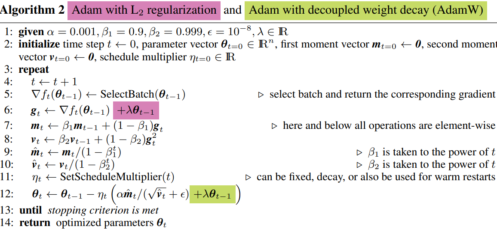

I'll not describe every detailed method in this post, because most concepts are duplicated with 
- Weight decay and L2 regularization part would be focused in here.

# Paper info
- **Title**: *DECOUPLED WEIGHT DECAY REGULARIZATION*
- **Authors**: Ilya Loshchilov & Frank Hutter
- **URL** : https://arxiv.org/pdf/1711.05101
- **Length**: 19 pages
	- REFERENCES: 3 pages
	- APPENDIX: 8 pages

# 0. Background
1. 
2. Weight Decay: $\theta_t = \theta_{t-1} - \lambda * \theta_{t-1} = (1-\lambda)*\theta_{t-1}$
	- The purpose of weight decay is just decaying weight because the large weight is easy to cause overfitting
	- If we can have the same result with smaller weight, then the smaller one is preferred
3. L2 regularization
	- Its purpose is the same as weight decay one, which is guiding parameter to be smaller during training
	- But unlike the weight decay, it originates from the loss function. So unlike the weight decay, the loss, gradient, and weights are all related to the amount of weight decay

# 1. Motivation
The purpose of both weight decay and L2 regularization is the same, which is guiding the amount of weight to be small.
- L2 reg: We will include weight value as a loss too. So the large weight would be linked to large loss. 
- Weight decay: If we get gradient of weight on the loss, as the weight increases, the gradient value would be increased too. Then in the weight update, the weight would be decreased too
- As evidence that the two methods have similar effect, the L2 reg has the same effect as weight decay in SGD optimizer

SGD with momentum shows better performance than Adam with L2 regularization (L2 reg).
But we can't just conclude SGD is better than Adam because there is an unexpected side effect on L2 reg in Adam, which is that the L2 reg doesn't act like naive weight decay.
For a long time, many people thought that `L2 reg` == `weight decay` and it's true **on SGD but not on adaptive optimizers**.
- Objective function $f(x)$ with L2 reg: $f_{\theta}(x) + \lambda*\sum_i{\theta_{t,i}^2}$
- SGD update with L2 reg: $\theta_t = \theta_{t-1} - lr * g_{t-1} = \theta_{t-1} - lr * (f'(x) + 2\lambda\theta_{t-1})$ 
- SGD with Weight Decay: $\theta_t = \theta_{t-1} - \lambda * \theta_{t-1}$
- if we set an appropriate lambda value, the effect of decaying weight would be the same in L2 reg and Weight Decay.

**But, on adaptive gradient methods like Adam, the L2 reg based optimization is not the same as weight decay anymore**
- Precisely, still they can have weight decaying but the amount of decaying is not as we expected.
Because when we calculated the gradient, the gradient of L2 reg is also included in that gradient, the objective function and L2 reg term's gradient are absorbed into the m and v in EMA calculation.
So, the gradient with L2 reg is different from weight decay $\theta_t = \theta_{t-1} - \lambda * \theta_{t-1}$ in SGD

PyTorch uses L2 reg in Adam when the paper was published (2019), so we need to pay more attention to the L2 reg problem

# 2. Explanation
## 2-1. The update rule of L2 reg and decoupled weight decay in Adam
1. L2 reg - Eqs. (1):
	- $$\frac{α{(1-\beta_1)*\sum_{i=1}^{t}(\beta_1^{t-i} * (g_{i} + \lambda \theta_{t-1}))}}{\sqrt{{((1-\beta_2)*\sum_{i=1}^{t}(\beta_2^{t-i} * (g_{i} + \lambda \theta_{t-1})^2 ))}} + \epsilon} =$$
 	 $\frac{α{(1-\beta_1)*\sum_{i=1}^{t}(\beta_1^{t-i} * g_{i})}}{\sqrt{{(1-\beta_2)*\sum_{i=1}^{t}(\beta_2^{t-i} * (g_{i} + \lambda \theta_{t-1})^2 )}} + \epsilon}$ + $\frac{α{(1-\beta_1)*\sum_{i=1}^{t}(\beta_1^{t-i} * \lambda \theta_{t-1})}}{\sqrt{{(1-\beta_2)*\sum_{i=1}^{t}(\beta_2^{t-i} * (g_{i} + \lambda \theta_{t-1})^2 )}} + \epsilon}$

2. decoupled weight decay  - Eqs. (2): 
	- $$\frac{α{(1-\beta_1)*\sum_{i=1}^{t}(\beta_1^{t-i} * g_{i})}}{\sqrt{{(1-\beta_2)*\sum_{i=1}^{t}(\beta_2^{t-i} * g_{i}^2)}} + \epsilon} +\lambda \theta_{t−1}$$

## 2-2. What's the difference?
We can compare the weight decaying part of gradient update formula in L2 reg and decoupled weight decay. 
- it's not a 100% fair comparison though because the denominator in the gradient update term is not the same

Refer to the Eqs. (1)-(2)
- Weight decay in L2 reg: 
	- $$\frac{α{(1-\beta_1)*\sum_{i=1}^{t}(\beta_1^{t-i} * (\lambda \theta_{t-1}))}}{\sqrt{{(1-\beta_2)*\sum_{i=1}^{t}(\beta_2^{t-i} * (g_{i} + \lambda \theta_{t-1})^2 )}} + \epsilon}$$
- Weight decay in decoupled weight decay
	-  $\lambda \theta_{t−1}$

**The main difference is that division by the gradient is included in the weight decay**

## 2-3. Is the L2 reg worse than decoupled weight decay?
### 2-3-1. Is division by the gradient good for weight decay?
We don't know whether L2 reg in Adam is better or worse than decoupled weight decay because the weight scale is almost irrelevant to the gradient scale.
- Deciding weight decay amount based on gradient(L2 reg) is almost like deciding decay value adding random distribution noise

So there could be better or worse cases than decoupled weight decay. It's almost up to luck, unpredictable and not controllable 

In the extreme case
- If the weight is too large, then we have to shrink the weight with weight decay like 5%, 10%, or the other ratios of weight. 
- But in that situation, what if the gradient is also large? Then it would ruin the weight decay by decreasing the amount of weight decay while we need to decrease weight a lot.

Weight decay in L2 reg is related to gradient value, the $/\sqrt{v}$ is applied
- When the $\sqrt{v}$ is large, the amount of weight decay is decreased.
- The large $\sqrt{v}$ means that the recent gradients are unstable. In this case, one of the possible cases is that weight is large so low weight value could be more appropriate. We may need weight decay. But in here, the large $\sqrt{v}$ prevent to decrease the weight by decreasing the amount of weight decay.
	- **Seems not that appropriate property.**

I try to investigate whether it's worse or not in two views
1. Is the gradient scale relevant to the weight scale? 
	- if it's not, then we don't even need to consider gradient-based weight decay
	- Refer to  to know the relation of weight and gradient
		- The conclusion is that they are irrelevant so affecting the weight decay with gradient seems inappropriate
2. Is there a case that when we have a large gradient, the large amount of weight decay has more benefits than a small amount of weight decay?
	- This means we don't know which one would be right (We could check the statistics on whether the advantage when we choose a large amount of weight decay is more frequent or not)

# 3. Methodology
## 3-1. Theoretical explanation
Comparing to , just add weight decay on the gradient update part


- Figure in AdamW paper

## 3-2. Implementation from nanochat
```python
def adamw_step_fused(
    p: Tensor,              # (32768, 768) - parameter tensor
    grad: Tensor,           # (32768, 768) - gradient, the same shape as p
    exp_avg: Tensor,        # (32768, 768) - first moment, the same shape as p
    exp_avg_sq: Tensor,     # (32768, 768) - second moment, the same shape as p
    step_t: Tensor,         # () - 0-D CPU tensor, step count
    lr_t: Tensor,           # () - 0-D CPU tensor, learning rate
    beta1_t: Tensor,        # () - 0-D CPU tensor, beta1
    beta2_t: Tensor,        # () - 0-D CPU tensor, beta2
    eps_t: Tensor,          # () - 0-D CPU tensor, epsilon
    wd_t: Tensor,           # () - 0-D CPU tensor, weight decay
) -> None:

exp_avg.lerp_(grad, 1-beta1_t)

exp_avg_sq.lerp_(grad**2, 1-beta2_t)

p.add_(-1* lr_t * ((exp_avg/(1-beta1_t**step_t))/(torch.sqrt(exp_avg_sq/(1-beta2_t**step_t)) + eps_t) + wd_t*p))
```
