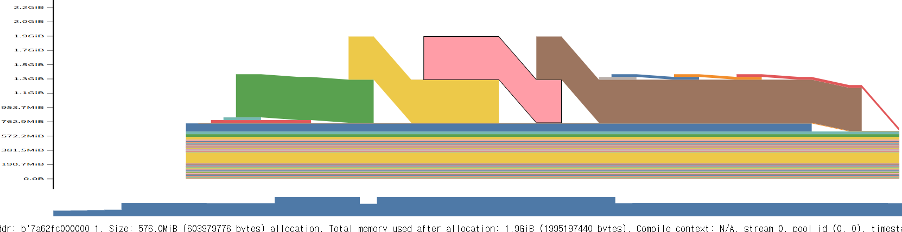
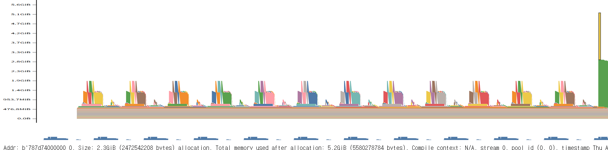

The implementation and experiment code is on [GitHub](https://github.com/winterstar67/model-efficiency-lab/tree/main/Memory%20measurement).

# 1. Introduction
These days, a GPU is an essential resource to handle deep learning because of its huge number of operations.
With the evolution of the deep learning model and its techniques, more and more GPU specs are required.


# 2. Components that consume GPU memory
## 2-1. Model parameters
- Model parameters participate in the inference process
## 2-2. Data and Forward activations
- We load the data onto the GPU, and the result of the operation between the model parameters and the data, the activations,  is also saved and used in the next step on the GPU.
## 2-3. Optimizer (Only in training case)
- The amount of GPU consumption differs by what optimizer you choose. For example, 
	- If the optimizer is Adam, the number of parameters would be 2x the model parameters, namely the first and second moments
	- If the optimizer is SGD, the number of parameters would be 0 because the update happens only with learning rate and gradients.
## 2-4. Gradient backpropagation (Only in training case)
- It has the same shape as model parameters do, but the parameters in the buffer shouldn't be counted. Only the parameters with `requires_grad` have the gradients.

# 3. Model parameters of nanoGPT
## 3-1. Default dtype of parameters: fp32 (4 bytes)

## 3-2. Structure decomposition
```
# Structure
GPT
|
|-- wte = nn.Embedding # vocab_size * embed_dim = 38,633,472
|
|-- wpe = nn.Embedding # dim_size * embed_dim = 786,432
|
|-- h = nn.ModuleList([Block(config) for _ in range(config.n_layer)]) # * 12
|   |
|   |-- self.ln_1 = LayerNorm # 1,536
|   |
|   |-- self.attn = CausalSelfAttention # 2,362,368
|   |
|   |-- self.ln_2 = LayerNorm # 1,536
|   |
|   |-- self.mlp = MLP # 4,722,432
|
|-- ln_f = LayerNorm # 1,536
```
### 3-2-1. LayerNorm
```
# Total n_embd*2 = 768*2 parameters

	# n_embd = 768 weight parameters per one LayerNorm
self.weight = nn.Parameter(torch.ones(ndim))
	# n_embd = 768 bias parameters per one LayerNorm
self.bias = nn.Parameter(torch.zeros(ndim)) if bias else None
```
### 3-2-2. CausalSelfAttention:
```
# Total 768*3*769 + 768*769 = 768*769*4

# key, query, value projections for all heads, but in a batch
self.c_attn = nn.Linear(config.n_embd, 3 * config.n_embd, bias=config.bias)
	# `config.n_embd, 3 * config.n_embd` for weights
	# `3 * config.n_embd` for bias
	# 768 * 3 * 768 + 3 * 768

# output projection
self.c_proj = nn.Linear(config.n_embd, config.n_embd, bias=config.bias)
	# config.n_embd * config.n_embd
	# 768 * 768 + 768
```
### 3-2-3. MLP
```
Total 2,362,368 + 2,360,064 = 4,722,432

# config.n_embd, 4 * config.n_embd
	# 768 * 4 * 768(Weights) + 4*768(Bias) = 768 * 4 * 769 = 2,362,368
self.c_fc    = nn.Linear(config.n_embd, 4 * config.n_embd, bias=config.bias)

self.gelu    = nn.GELU()
# config.n_embd, 4 * config.n_embd
	# 768 * 4 * 768(Weights) + 768(Bias) = 2,360,064
self.c_proj  = nn.Linear(4 * config.n_embd, config.n_embd, bias=config.bias)
```
## 3-3. Total model size
The model size is 38,633,472 + 786,432 + 12*(1,536 + 2,362,368 + 1,536 + 4,722,432) + 1,536 = $124,475,904\approx 124.5$M.
Because the default dtype of parameters is fp32 which uses 4 bytes, the model file size is $124.5$M $* 4$ bytes = $498$MB


# 4. Data and Forward activations in nanoGPT
In training case, we should know all the values which are needed to calculate gradient, which depends on the implementation.
Rather than calculating the values by hand, it would be better to verify them by running the code and experiments.
**In this part, I'll calculate only the validation part which doesn't need gradient.**

## 4-1. Data and forward structure
Suppose the `B = batch_size = 12`
### 4-1-1. Loaded data
Because `np.memmap` is used, only the data processed during a model train/validation step consumes the memory.
So, the entire token number is `B * block_size = 12 * 1024 = 12,288`.
- If B is not decided, `B * 1024`

The dtype of each token is `int64` whose bytes is 8, so the file size of loaded data per each step is `12,288 * 8 bytes = 98,304 bytes` $\approx$ `0.1MB`
- If B is not decided, `B * 8,192 bytes`
### 4-1-2. Forward activations
Because there are many steps of writing, removing, and rewriting on the same variable, I'll describe the peak memory usage.
The peak memory of the validation case would be different from the one of training case.
- The forward activations in the validation are removed when the next activation is calculated.

#### 4-1-2-1. GPT forward
```
# GPT forward

# tok_emb = B * t * n_embd = 12*1024*768 = 9,437,184 -> * 4 bytes = 37,748,736 bytes = 38MB
	# If B is not decided, B * 3,145,728 bytes
tok_emb = self.transformer.wte(idx) # token embeddings of shape (b, t, n_embd)

# pos_emb = t * n_embd = 1024*768 = 786,432 -> * 4 bytes = 3,145,728 = 3MB
pos_emb = self.transformer.wpe(pos) # position embeddings of shape (t, n_embd)

# x = B * t * n_embd= 12*1024*768 -> * 4 bytes = 37,748,736 bytes = 38MB 
	# If I set tok_emb instead of x, would it save the memory?
x = self.transformer.drop(tok_emb + pos_emb)
for block in self.transformer.h:
	# peak memory of block(x) = max(1398MB, 189MB) = 1398MB
	x = block(x)

# Layer normed output, the x above has more elements
	# x = (B, T, n_embd) = B * 1024 * 768 * 4 bytes = 38MB
x = self.transformer.ln_f(x)

if targets is not None:
	# logits = (B, t, vocab_size) = 12 * 1024 * 50304 = 618,135,552 -> * 4 bytes = 2,472,542,208 = 2,473MB
		# If B is not decided, B * 206,045,184 bytes
	logits = self.lm_head(x)
	
	# F.cross_entropy has softmax calculation
	# softmax of logits = (B, t, vocab_size) = 12 * 1024 * 50304 = 618,135,552 -> * 4 bytes = 2,472,542,208 = 2,473MB
		# If B is not decided, B * 206,045,184 bytes
	loss = F.cross_entropy(logits.view(-1, logits.size(-1)), targets.view(-1), ignore_index=-1)

else:
	# logits = (B, t, vocab_size) = 12 * 1 * 50304 = 603,648 -> * 4 bytes = 2,414,592 = 2MB
		# If B is not decided, B * 201,216 bytes
	logits = self.lm_head(x[:, [-1], :]) # note: using list [-1] to preserve the time dim
	# loss = 0 Bytes
	loss = None

return logits, loss
```

#### 4-1-2-2. Block forward
```
def forward(self, x):
	# 38MB + 114MB + 604MB + 38MB (residual x) = 794MB
		# If this was peak, then it would be 38MB + 114MB + 604MB*2 + 38MB (residual x) = 1398MB
	x = x + self.attn(self.ln_1(x))
	# 151MB + 38MB (residual x) = 189MB
	x = x + self.mlp(self.ln_2(x))
```

#### 4-1-2-3. CausalSelfAttention forward
```
# calculate query, key, values for all heads in batch and move head forward to be the batch dim

# input x is 38MB which is the same form as `# y = 12*1024*768 = 9,437,184 -> * 4 bytes = 37,748,736 = 38MB`
# q -> (B,t,n_embd) - 12*1024*768
# k -> (B,t,n_embd) - 12*1024*768
# v -> (B,t,n_embd) - 12*1024*768
# 12 * 1024 * 768 * 3 = 28,311,552 -> * 4 bytes = 113,246,208 = 114MB
	# If B is not decided, B * 9,437,184 bytes
q, k, v  = self.c_attn(x).split(self.n_embd, dim=2)
k = k.view(B, T, self.n_head, C // self.n_head).transpose(1, 2) # (B, nh, T, hs)
q = q.view(B, T, self.n_head, C // self.n_head).transpose(1, 2) # (B, nh, T, hs)
v = v.view(B, T, self.n_head, C // self.n_head).transpose(1, 2) # (B, nh, T, hs)


# causal self-attention; Self-attend: (B, nh, T, hs) x (B, nh, hs, T) -> (B, nh, T, T)
# att = 12*12*1024*1024 = 150,994,944 -> * 4 bytes = 603,979,776 = 604MB
	# If B is not decided, B * 50,331,648 bytes
	# Because masked_fill creates new tensor, the memory in attention part can spike to 604MB+604MB in the validation.
att = (q @ k.transpose(-2, -1)) * (1.0 / math.sqrt(k.size(-1)))
att = att.masked_fill(self.bias[:,:,:T,:T] == 0, float('-inf'))
att = F.softmax(att, dim=-1)
att = self.attn_dropout(att)

# y = 12*1024*768 = 9,437,184 -> * 4 bytes = 37,748,736 = 38MB
	# If B is not decided, B * 3,145,728 bytes

y = att @ v # (B, nh, T, T) x (B, nh, T, hs) -> (B, nh, T, hs)

y = y.transpose(1, 2).contiguous().view(B, T, C) # re-assemble all head outputs side by side

y = self.resid_dropout(self.c_proj(y))
return y
```

#### Verification of attention layer memory in validation mode

- The consumed memory for the `att` tensor (`att = q @ k.transpose(-2, -1)`) exactly matches the hand-derived value of 603,979,776 bytes
- The peak memory at the self-attention layer is $498 + 0.1 + 38 + 3 + 1,360$ MB = $1.9$GB. And Memory viz shows about $1.99$ GB memory usage and that's similar to hand-driven one
	- Model: $498$MB
	- Data load: $0.1$MB
	- Token embedding: $38$MB
	- Position embedding: $3$MB
	- CausalSelfAttention: $38 + 114 + 1,208 = 1,360$ MB
- [Test code link](https://github.com/winterstar67/model-efficiency-lab/blob/main/Memory%20measurement/One_selfattention/SelfAttention_Memory.py#L200)

#### 4-1-2-4. MLP forward
```
# num of params: Peak one is b*t*4*n_embd = 12*1024*4*768 = 37,748,736 -> * 4 bytes = 150,994,944 = 151MB
	# If B is not decided, 3,145,728 bytes
	# It can spike up to 302MB.
    def forward(self, x):
        x = self.c_fc(x)
        x = self.gelu(x)
        x = self.c_proj(x)
        x = self.dropout(x)
        return x
```

## 4-2. Memory consuming component in Train vs. Validation
### Training process holds
- Loaded data
- Model parameters
- Gradient
- Activations 
- Intermediate values required for gradient calculation in every layer during the forward pass
- Optimizer parameters

### Validation process holds
- Loaded data
- Model parameters
- Forward activation in the current process layer

# 5. Adam Optimizer in nanoGPT
## 5-1. Adam parameters 
- First moment: Individual parameter has each first moment
	- So the file size of first moment parameter is the same as model size which is $124.5$M $* 4$ bytes=$498$MB
- Second moment: Individual parameter has each second moment
	- So the file size of second moment parameter is the same as model size which is $124.5$M $* 4$ bytes=$498$MB
## 5-2. Adam file size
The total file size of Adam parameters is $498 * 2 = 996$ MB

# 6. Gradient in nanoGPT
## 6-1. Gradient elements
$124$M individual weights are updated individually by calculating gradients of each weight.
- Each weight's gradient is calculated
## 6-2. Gradient file size
The number of gradient elements is the same as model size.
So the file size of gradient is $124.5$M $* 4$bytes = $498$MB

# 7. Result
The total calculated memory usage is the following
## 7-1. Training case
I didn't calculate the memory usage for the training case because it doesn't just keep the forward activation result — it stores intermediate results that differ per layer type, such as MLP, GELU, softmax, etc.
It would take lots of time to find out and calculate each of the intermediate forward results stored to calculate the gradient. So, just checking it with an experiment would be better.

## 7-2. Validation case = $5,523.1$ MB
$498$(Model parameter) + $5025$(Activations) = $5523.1$ MB
- Model parameter: $498$MB
- Activations: $(0.1+38+3+38) + \max([1,398,\text{ } 4,946])$ = $5025.1$ MB
	- Data load: $0.1$MB
	- Token embedding: $38$MB
	- Position embedding: $3$MB
	- x: 38MB
	- Block: $\max(302+38,\text{ } 1,360+38)$MB = $1,398$MB
		- CausalSelfAttention: $38 + 114 + 1,208 = 1,360$ MB
			- Input: $38$MB
			- Q, K, V embedding: $114$MB
			- Attention layers (applies to all 12 layers): $604*2$ = $1,208$MB
				- $*2$ is conducted because the spike by continuous code execution shoud be considered
		- Residual `x` in `x = x + self.attn(self.ln_1(x))`: $38$MB
		- MLP: $151 * 2$ = $302$ MB
			- $* 2$ is conducted because the spike by continuous code execution shoud be considered
		- Residual `x` in `x = x + self.mlp(self.ln_2(x))`: $38$MB
	- Logits at the last layer: $2,473$MB
	- Softmax during the cross entropy calculation: $2,473$MB
	

- Total validation memory usage tracking
- The peak memorys in Memory vize and hand-driven one are similar 
	- Memory viz: $5.580$GB
	- hand-driven: $5.523$GB
- [Test code link](https://github.com/winterstar67/model-efficiency-lab/blob/main/Memory%20measurement/First_batch/First_Batch_Memory.py#L200)

# 8. Discussion
The hand-derived calculation would not be 100% correct because there could be uncovered operations inside PyTorch that have C++/CUDA implementations which are at a lower level than torch code written by humans.
