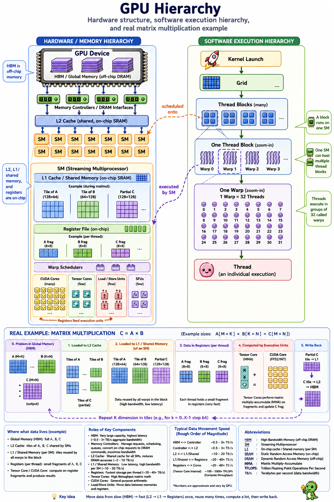
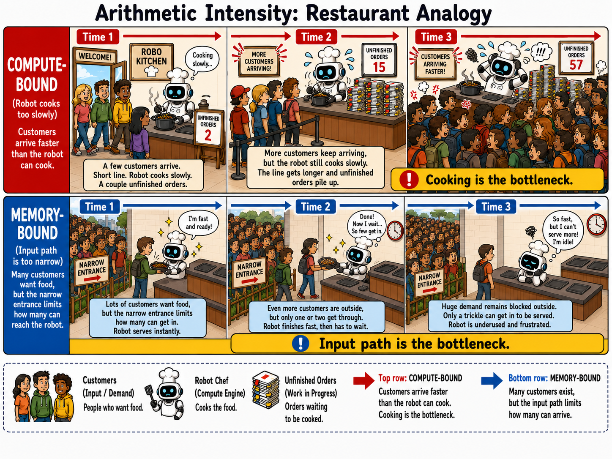
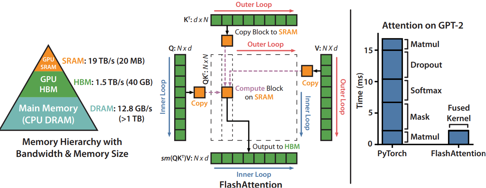

# Paper info
- **Title**: *FlashAttention: Fast and Memory-Efficient Exact Attention with IO-Awareness*
- **Authors**: Tri Dao, Daniel Y. Fu, Stefano Ermon, Atri Rudra, and Christopher Ré
- **URL**: https://arxiv.org/pdf/2205.14135
- **Length**: 34 pages

# 0. Background
## 0-1. GPU
- HBM: Data transfer from/into HBM is slow, but it has large memory
- SRAM: Data transfer from/into SRAM is fast, but it has small memory
- The purpose of FlashAttention is reducing the number of IO tasks on HBM but doing most of the work in SRAM.


- The image is generated by ChatGPT
## 0-2. Kernel Execution
Steps of calling one kernel
1. Load data from HBM to register and SRAM
2. Operate kernel
3. Write the output to HBM.
```
# ChatGPT answer

HBM
 ↓
Memory Controller / DRAM interface
 ↓
L2 Cache  ← on-chip SRAM
 ↓
L1 Cache inside SM / Shared Memory  ← on-chip SRAM
 ↓
Register File
 ↓
CUDA Core / Tensor Core / Load-Store Unit
```

If the several `n` kernels(several operations) can be compressed or fused into one kernel, it would decrease `O(n)` of HBM read/write into `O(1)` complexity.
Fusion of multiple kernels could be conducted by compilers like `torch.compile`, but for the model training, results of each kernel before fusion should be written to HBM anyway.


## 0-3. Arithmetic intensity
Arithmetic intensity is a method to analyze efficiency between memory access and computation. Arithmetic intensity can detect two phenomena to improve the efficiency of calculation speed, (1) **Compute bound** and (2) **Memory bound**

### 0-3-1. Compute-bound
**Compute-bound** means that if the compute is too slow compared to memory read/write speed, then no matter how much we improve the speed of data load/write, it won't speed up getting the result.

### 0-3-2. Memory-bound
**Memory-bound** means that if the memory read/write is too slow compared to computation speed, then no matter how much we improve the speed of computation, it won't speed up getting the result.

### 0-3-3. Restaurant example
Let's take a situation of a restaurant run by only cooking machines and customers as an example.
To receive as many customers as possible, both a fast cooking machine to serve the food quickly and many customers to buy it should exist.
1. Compute-bound is the situation that customers are lining up and 100 customers are stacked per second outside while cooking and serving the food for one customer takes 2 seconds. More and more customers would be stacked on the line outside of the restaurant
2. Memory-bound is the situation that cooking machine is so fast that it can cook and serve the food in 0.1 sec and there are many customers but the entrance is too small so only one person can enter per second.


- The image is generated by ChatGPT

# 1. Motivation (Standard Attention)
The standard attention in the "Attention is all you need" paper has $O(n^2)$ scale of complexity.
Most research before FA focused on FLOPs estimation rather than the IO process.
- Even if the FLOPs(computational efficiency) are improved, the wall-clock time could not be improved when memory bound exists

Suppose the following settings
1. Load $Q, K, V \in \mathbb{R}^{N \times d}$ from HBM
2. $S = QK^{\top} \in \mathbb{R}^{N \times N}$ - **Dot product $\rightarrow$ S goes to HBM**
3. Load $S$ from HBM
4. $P = \text{softmax}(S, \text{dim}=\text{row-wise}) \in \mathbb{R}^{N \times N}$ - **Mask and Softmax $\rightarrow$ P goes to HBM**
5. Load $P$ and V from HBM
6. $O = PV \in \mathbb{R}^{N \times d}$ - **Dot product** $\rightarrow$ **O goes to HBM**
7. Return $O$

## 1-1. The steps of standard attention computation
- Matmul
- Mask
- Softmax
- Matmul

Each step is an independent kernel. And calling one kernel has one IO process between HBM and SRAM.

But, on the modern GPU, computation speed is faster than memory speed (mentioned in the paper). So, no matter how fast the calculation speed is, if there's memory bound, then the effect of calculation efficiency improvement would be overshadowed.
Authors focused on the IO process of GPU between HBM and SRAM.


- [Figure 1 from FlashAttention paper](https://arxiv.org/pdf/2205.14135)

# 2. Explanation

## 2-1. Overview of FA
FA is a new kernel that calculates attention yielding the same result as standard attention.
But, 
1. It requires fewer HBM accesses than the standard one.
2. It does not store $O(N^2)$ intermediate values for the backward pass

## 2-2. Based calculation for FA
It's an incremental way which is similar to an incremental average.
- $x$ is a vector. $x = [x_1, x_2, ..., x_B]$, $x \in \mathbb{R}^{B}$
	- Each $x_i$ in $x_1, ..., x_B$ corresponds to a query of one token
- $m(x) = \max_{i}(x_i)$
- $f(x) := [e^{x_1 - m(x)}, e^{x_2 - m(x)}, ... , e^{x_B - m(x)}]$
- $l(x) := \sum_i{f(x)_i}$
- $\text{softmax}(x) = \frac{f(x)}{l(x)}$ 
- We need extra notation to deal with between vectors because it's an incremental way
	- $m(x) = m([x^1, x^2]) = \max{(m(x^1), max(x^2))}$
		- $x^1$ and $x^2$ are vectors such that $x^1, x^2 \in \mathbb{R}^{B}$
		- $x^1=[x_{11}, x_{12}, ..., x_{1B}]$
		- $x^2=[x_{21}, x_{22}, ..., x_{2B}]$
	- $f(x) = [e^{m(x^1)-m(x)}f(x^1), e^{m(x^2)-m(x)}f(x^2)] = [e^{x_{11}-m(x)}, e^{x_{12}-m(x)}, ..., e^{x_{21}-m(x)}, e^{x_{22}-m(x)}, ..., e^{x_{2B}-m(x)}]$
		- $m(x^1)$ means the max value within $x^1$ vector
		- $m(x)$ means the max value within $x^1 \cup x^2$ vector
	- $l(x) = l([x^1, x^2]) = e^{m(x^1) - m(x)}l(x^1) + e^{m(x^2)-m(x)}l(x^2) = e^{x_{11}-m(x)} + e^{x_{12}-m(x)} + ... + e^{x_{21}-m(x)} + e^{x_{22}-m(x)} + ... + e^{x_{2B}-m(x)}$
	- $\text{softmax}(x) = \frac{f(x)}{l(x)}$
	- These are kind of application of softmax of $x^1 \cup x^2$

### 2-2-1. How to get $x^{t-1} \cup x^t$ softmax using the softmax of $x^{t-1}$
Suppose we have $m_{t-1}$, $l_{t-1}$, and $O_{t-1}$ in prev step $t-1$. Then, $f_{t-1}$ = $O_{t-1} * l_{t-1}$.
So,
- $f_t$ from step $0$ to $t$ would be $f_t = [e^{m_{t-1}(x) - m_{new}(x)}*f_{t-1} + e^{\tilde{m}(x) - m_{new}(x)}*\tilde{f}]$
- $l_t$ from step $0$ to $t$ would be $l_t = [e^{m_{t-1}(x) - m_{new}(x)}*l_{t-1} + e^{\tilde{m}(x) - m_{new}(x)}*\tilde{l}]$
- $O_t = \frac{f_t}{l_t}$.

## 2-3. FA Algorithm
**This section only covers the forward pass. The backward pass — which recomputes S and P on-the-fly using the O, l, m saved from the forward pass, instead of storing O(N²) values — is not covered in this post.**

Require: Matrices Q, K, V ∈ R $N \times d$ in HBM, on-chip SRAM of size M.
1. Set block sizes $B_c = \lceil\frac{M}{4d}\rceil$, $B_r = min(\lceil\frac{M}{4d}\rceil, d)$
	- Block size: A size of matrix unit that one SRAM can hold all chunked Q, K, V, and O at once.
		- If we consider $l$ and $m$ below, the extra memory would be needed though.
	- SRAM is too small to hold the whole matrices Q, K, V. So, it chunks each matrix
2. Initialize the following variables in HBM
	- $O = (0)_{N \times d} \in \mathbb{R}^{N \times d}$  -  because it's being adding up, it starts from 0
	- $l = (0)_N \in \mathbb{R}^N$
	- $m = (-\infty)_N \in \mathbb{R}^N$ - there's no number lower than $-\infty$
3. Chunks each matrix into individual blocks
	- Blocks of $Q$    : Divide $Q \in \mathbb{R}^{N \times d}$ into $T_r=\lceil \frac{N}{B_r} \rceil$ blocks. $Q_1, ..., Q_{T_r} \in \mathbb{R}^{B_r \times d}$
	- Blocks of $K, V$: Divide $K, V \in \mathbb{R}^{N \times d}$ into $T_c=\lceil \frac{N}{B_c} \rceil$ blocks. $K_1, V_1 ..., K_{T_c}, V_{T_c} \in \mathbb{R}^{B_c \times d}$
	- Blocks of $O$    : Divide $O \in \mathbb{R}^{N \times d}$ into $T_r=\lceil \frac{N}{B_r} \rceil$ blocks. $O_1, ..., O_{T_r} \in \mathbb{R}^{B_r \times d}$
	- Blocks of $l$     : Divide $l \in \mathbb{R}^{N}$ into $T_r=\lceil \frac{N}{B_r} \rceil$ blocks. $l_1, ..., l_{T_r} \in \mathbb{R}^{B_r}$
	- Blocks of $m$   : Divide $m \in \mathbb{R}^{N}$ into $T_r=\lceil \frac{N}{B_r} \rceil$ blocks. $m_1, ..., m_{T_r} \in \mathbb{R}^{B_r}$
	- Why are $Q$, $O$, $m$, and $l$ divided into same block size $B_r$ while $K$ and $V$ are divided into $B_c$?
		- The size of $K$ and $V$ doesn't have to be the same as the $Q$'s one
		- But $Q$, $O$, $m$, and $l$ should have same size. For the outer loop whose j=1,
			- $O$ has $N \times d$ shape which means that the result $O$ would be handed over to the next layer, and again, the O would be split into Q, K, V of next layer. The first query in the current token corresponds to the first token of O. 
				- The 1st token of $Q$ is mapped to 1st token of $O$
			- $m_i$ means the max value per each row of $QK^\top$, which means per query token
			- $l_i$ means the summation of $f(x)$ per row of $QK^\top$, which means per query token

4. Two nested for loop
	- Outer loop is $1 \leq j \leq T_c$ 
		- Load $K_j, V_j$ from HBM to on-chip SRAM
	- Inner loop is $1 \leq i \leq T_r$
		- Load $Q_i, O_i, l_i, m_i$ from HBM to on-chip SRAM 
			- $O_i, l_i, m_i$ are the results added up until the prev step
		- Calculate current step's $S, m, f, l$
			- Compute $S_{ij} = Q_iK_j^\top$ - On-chip operation
			- Compute $\tilde{m_{ij}} = \text{rowmax}(S_{ij})$
			- Compute $\tilde{P_{ij}} = \exp(S_{ij}-\tilde{m_{ij}})$
			- Compute $\tilde{l_{ij}} = \sum_{\text{row sum}}{\tilde{P_{ij}}}$
		- Calculate the new operands which are covered from i=0 to the current step
			- $m_i^{\text{new}} = \max(\tilde{m_{ij}}, m_i)$
			- $l_i^{\text{new}} = \exp{(m_i - m_i^{new})}*l_i + \exp{(\tilde{m_{ij}} - m_i^{new})}*\tilde{l_{ij}}$
			- Write $O_i = \frac{(\exp{(m_i - m_i^{new})} * O_i * l_i + \exp{(\tilde{m_{ij}} - m_i^{new})} \tilde{P_{ij}} V_j)}{l_i^{new}}$ to HBM
				- Each row of $O_i$ is multiplied with each element in $l_i$ in order. In the paper, it's expressed in $\text{diag}(l_i)*O_i$
			- Write $l_i = l_i^{new}$ and $m_i = m_i^{new}$ to HBM
5. Return $O$

### 2-3-1. Process for each step
#### Each inner loop step when $j=1$
1. $$\text{softmax when i=1} \rightarrow  \left(\begin{array}{cccc}\frac{q_{1}k_1^\top}{q_{1}k_1^\top} & ? & ? \\ ? & ? & ? \\ ? & ? & ? \\\end{array}\right)$$
2. $$\text{softmax when i=2} \rightarrow \left(\begin{array}{cccc}\frac{q_{1}k_1^\top}{q_{1}k_1^\top} & ? & ? \\\frac{q_{2}k_1^\top}{q_{2}k_1^\top} & ? & ? \\ ? & ? & ? \\\end{array}\right)$$
3. $$\text{softmax when i=3} \rightarrow \left(\begin{array}{cccc}\frac{q_{1}k_1^\top}{q_{1}k_1^\top} & ? & ? \\\frac{q_{2}k_1^\top}{q_{2}k_1^\top} & ? & ? \\\frac{q_{3}k_1^\top}{q_{3}k_1^\top} & ? & ? \\\end{array}\right)$$

#### Each outer loop step when $i=1, ..., n$ is done
1. $$\text{softmax when j=1} \rightarrow \left(\begin{array}{cccc}\frac{q_{1}k_1^\top}{q_{1}k_1^\top} & ? & ? \\\frac{q_{2}k_1^\top}{q_{2}k_1^\top} & ? & ? \\\frac{q_{3}k_1^\top}{q_{3}k_1^\top} & ? & ? \\\end{array}\right)$$
2. $$\text{softmax when j=2} \rightarrow \left(\begin{array}{cccc}\frac{q_{1}k_1^\top}{q_{1}k_1^\top + q_{1}k_2^\top} & \frac{q_{1}k_2^\top}{q_{1}k_1^\top + q_{1}k_2^\top} & ? \\\frac{q_{2}k_1^\top}{q_{2}k_1^\top + q_{2}k_2^\top} & \frac{q_{2}k_2^\top}{q_{2}k_1^\top + q_{2}k_2^\top} & ? \\\frac{q_{3}k_1^\top}{q_{3}k_1^\top + q_{3}k_2^\top} & \frac{q_{3}k_2^\top}{q_{3}k_1^\top + q_{3}k_2^\top} & ? \\\end{array}\right)$$
3. $$\text{softmax when j=3} \rightarrow \left(\begin{array}{cccc}\frac{q_{1}k_1^\top}{q_{1}k_1^\top + q_{1}k_2^\top + q_{1}k_3^\top} & \frac{q_{1}k_2^\top}{q_{1}k_1^\top + q_{1}k_2^\top + q_{1}k_3^\top} & \frac{q_{1}k_3^\top}{q_{1}k_1^\top + q_{1}k_2^\top + q_{1}k_3^\top} \\\frac{q_{2}k_1^\top}{q_{2}k_1^\top + q_{2}k_2^\top + q_{2}k_3^\top} & \frac{q_{2}k_2^\top}{q_{2}k_1^\top + q_{2}k_2^\top + q_{2}k_3^\top} & \frac{q_{2}k_3^\top}{q_{2}k_1^\top + q_{2}k_2^\top + q_{2}k_3^\top} \\\frac{q_{3}k_1^\top}{q_{3}k_1^\top + q_{3}k_2^\top + q_{3}k_3^\top} & \frac{q_{3}k_2^\top}{q_{3}k_1^\top + q_{3}k_2^\top + q_{3}k_3^\top} & \frac{q_{3}k_3^\top}{q_{3}k_1^\top + q_{3}k_2^\top + q_{3}k_3^\top} \\\end{array}\right)$$
