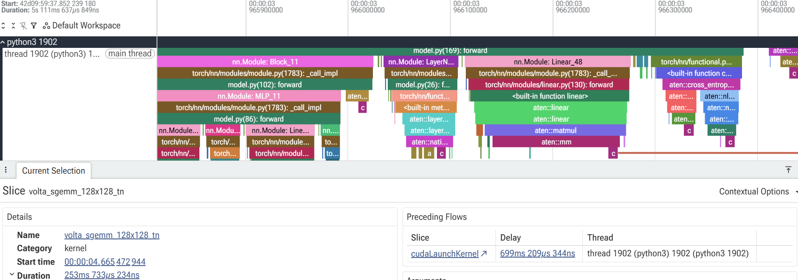
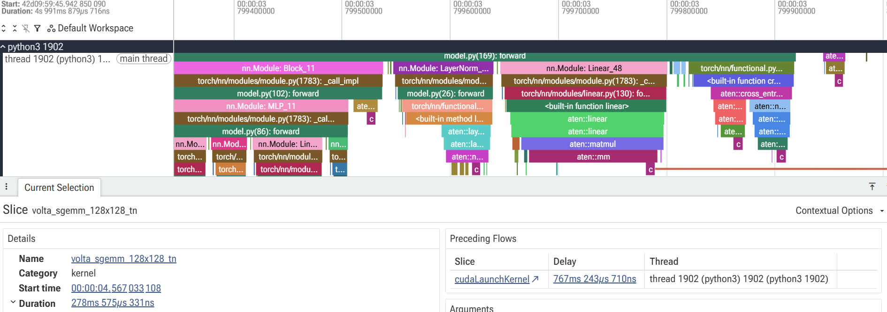
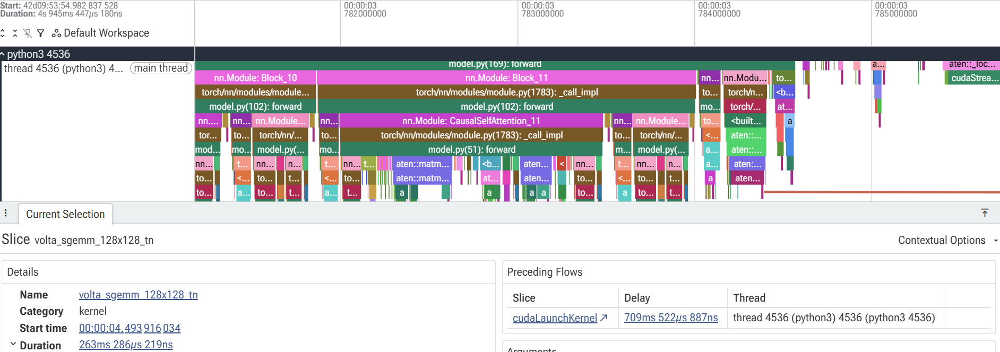
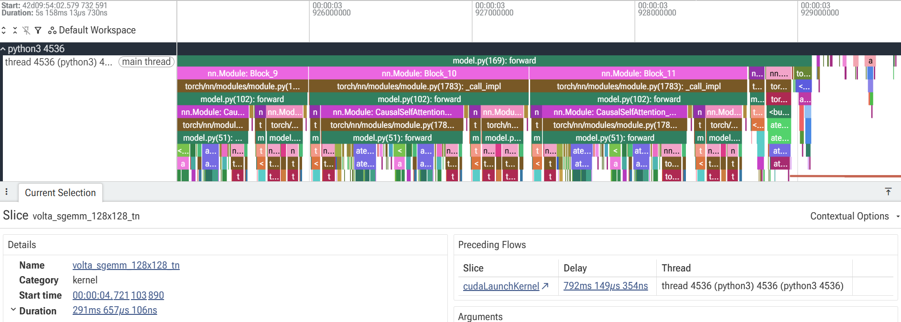
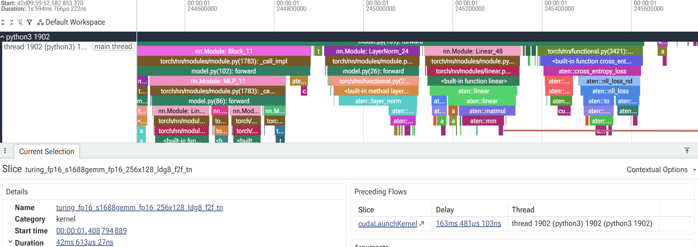
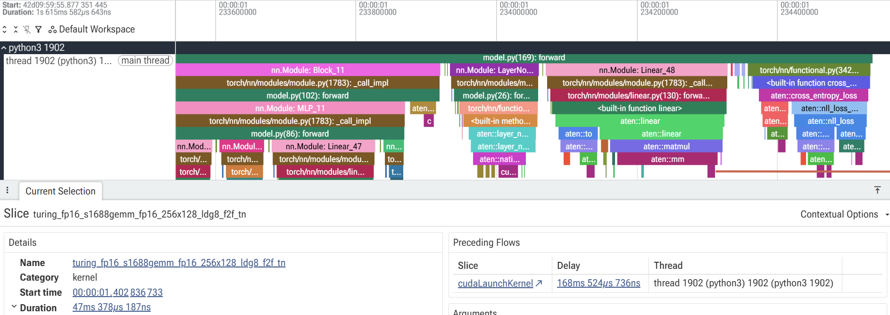
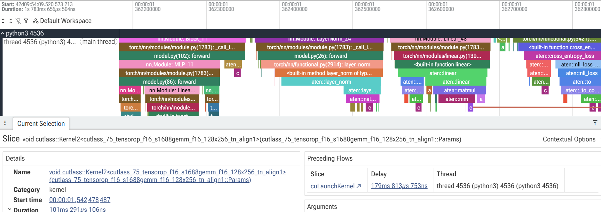
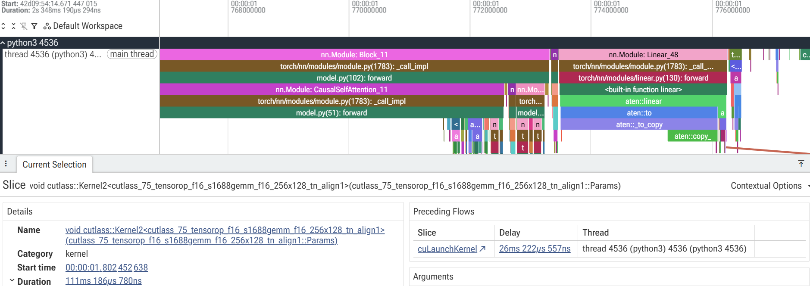
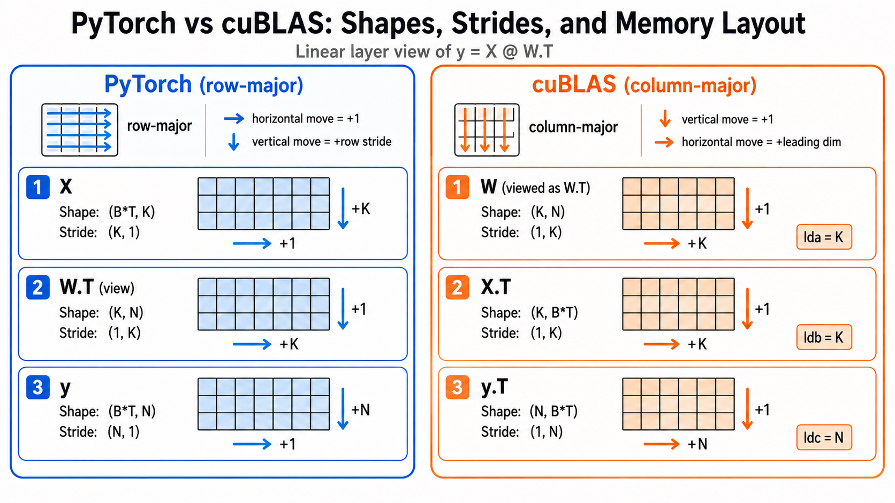

The implementation and experiment code is on [GitHub](https://github.com/winterstar67/model-efficiency-lab/tree/main/Kernel%20investigation).

Related posts:
- 

# 1. Motivation
While I was writing the code to evaluate the model on HellaSwag dataset, I saw that a more efficient kernel can be selected by weight shape (vocab size)
- Megatron used vocab size padding
- nanochat used vocab size padding

So, based on this observation, I thought that **maybe the shape of input data can affect the kernel selection so inference speed could become faster too**
- [FP16 requires a multiple of 8 elements](https://docs.nvidia.com/deeplearning/performance/dl-performance-getting-started/index.html#enable-tc)
- [Tensor Core operates on data in units of 16 bytes](https://docs.nvidia.com/deeplearning/performance/dl-performance-matrix-multiplication/index.html#requirements-tc)
- [cuBLAS uses column-major](https://docs.nvidia.com/cuda/cublas/index.html)

# 2. Hypothesis
If I set the batch size and token length with padding appropriately (a multiple of 8), CUDA would select the faster kernel.

# 3. Code and Settings
- I used HellaSwag data, so the batch size is a multiple of 4 (`B = 4*n`)

After running the code, I analyzed the kernel of the linear layer that embeds the activation to the vocab size dimension in the last layer by uploading the profiler trace file on Perfetto UI

# 4. Test cases
I tested a total of 8 cases
- FP32 vs. FP16
- Vocab size padded vs. not padded
- Batch size = 4×26 with token length ≡ 0 (mod 16), vs. batch size = 4×25 with odd token length.

The images below indicate the kernel of the linear layer embedding to the vocab size dimension in the last layer.

## 4-1. float32 case - No Tensor Core in T4 GPU
### 4-1-1. vocab padding, float32, BatchSize25, Token size padding odd case

- Kernel: volta_sgemm_128x128_tn
- Duration: 254$ms$ 733$\mu s$
### 4-1-2. vocab padding, float32, BatchSize26, Token size padding even

- Kernel: volta_sgemm_128x128_tn
- Duration: 278$ms$ 575$\mu s$
### 4-1-3. No vocab padding, float32, BatchSize25, Token size padding odd

- Kernel: volta_sgemm_128x128_tn
- Duration: 263$ms$ 286$\mu s$

### 4-1-4. No vocab padding, float32, BatchSize26, Token size padding even

- Kernel: volta_sgemm_128x128_tn
- Duration: 291$ms$ 657$\mu s$

## 4-2. float16 case - Tensor Core supported in T4 GPU
### 4-2-1. vocab padding, float16, BatchSize25, Token size padding odd

- Kernel: turing_fp16_s1688gemm_fp16_256x128_ldg8_f2f_tn
- Duration: 42$ms$ 613$\mu s$
### 4-2-2. vocab padding, float16, BatchSize26, Token size padding even

- Kernel: turing_fp16_s1688gemm_fp16_256x128_ldg8_f2f_tn
- Duration: 47$ms$ 378$\mu s$
### 4-2-3. No vocab padding, float16, BatchSize25, Token size padding odd

- Kernel: void_cutlass::Kernel2...
- Duration: 101$ms$ 291$\mu s$
### 4-2-4. No vocab padding, float16, BatchSize26, Token size padding even

- Kernel: void_cutlass::Kernel2...
- Duration: 111$ms$ 186$\mu s$

# 5. Result
## 5-1. FP32 case
Four FP32 cases show the same kernels. Every vocab size, batch size, and token size didn't affect the kernel selection.

## 5-2. FP16 case
Vocab size padding shows a different kernel selection having 2x faster operation speed than the non-padded case.
But, the batch size and token size didn't show the expected result as I hypothesized.

# 6. Analysis
Why didn't the batch size and token size affect kernel selection?
- First of all, the data shape `(B,T,K)` is treated as `(B*T,K)` in the linear layer. So when considering a multiple of 8, it's not about B and T individually being multiples of 8, but about `B*T` as a whole being a multiple of 8.

The reason that the batch size and the token size don't affect and vocab size affects is [that T4 GPU Tensor Core (Turing Tensor Core) doesn't support FP32](https://www.nvidia.com/en-us/data-center/tesla-t4/).
> [FP16 is also fully supported for workloads that require higher precision.](https://developer.nvidia.com/blog/?p=11872) Only the INT8, INT4, and FP16 are mentioned. FP32 is used for accumulation in mixed precision.

Suppose the shapes of variables in the last layer, `y = X @ W.T`, are the following (`B`: batch size, `T`: token length, `K`: embed dim, `N`: vocab size):
- `X` shape: `(B, T, K)`
- `W` shape: `(N, K)`
- `y` shape: `(B, T, N)`

Because the Tensor Core operates on data in units of 16 bytes, we should allocate the data to be a multiple of 8 in the FP16 case.
Here, the dimension axis is important. Suppose we have an input X with shape `(B,T,K)`.
When that input goes through the linear layer, the layer treats it as `(B*T, K)` form.
The weight of the linear layer, `W`, is `(N, K)` and when the linear layer is run, the operation is `y = X @ W.T`.
`y = X @ W.T` is a PyTorch representation, and PyTorch aligns the data in row-major order, which means the data in memory is filled one row at a time, completing a full row before moving to the next.
- If there's no manipulation of stride and `(K, N)` shape data has stride `(N, 1)`, it means that we need to jump `N * dtype's bytes` in memory to reach the next row.

Unlike PyTorch, the data alignment in cuBLAS is different. cuBLAS stores data in a column-major way.
So, keeping in mind that cuBLAS reads the data in a column-major way, if we investigate it,
- The weight `W` in PyTorch is stored as `W.T` whose shape is `(K, N)` in cuBLAS. The stride in cuBLAS is `(1, K)`. This is `lda`.
- The input `X` in PyTorch is stored in `X.T` whose shape is `(K, B*T)`. The stride in cuBLAS is `(1, K)`. This is `ldb`.
- `y=X @ W.T` in PyTorch becomes `y.T = W @ X.T` whose shape is `(N, K)` in cuBLAS. So the stride in cuBLAS is `(1, N)`. This is `ldc`.

The factors that affect the decision of using the Tensor Core are `K` and `N` which are embedding dimension and vocab size respectively.
- **In PyTorch, if we transpose W, then the stride of W.T is also transposed, which means the row-major becomes column-major.**
- **In cuBLAS, even if we transpose W.T into W, still the stride or memory access is done in column-major order of W.T**

The reason that vocab size affects kernel selection but batch size and token size don't is that there is `N` in the stride but there are no B and T terms in the stride.

But, it doesn't mean that the selection of batch size doesn't affect efficiency. It can affect the wave quantization and the tile quantization. This is based on the number of elements, not bytes.

# 7. What I learned
When we try to choose an efficient kernel, we must consider whether the GPU supports the Tensor Core of that dtype, whether cuBLAS supports the efficient kernel that utilizes the Tensor Core, the column-major based alignment in cuBLAS, and the dtype of the data we use and its byte size, etc.
- The Tensor Core usually supports a 16-byte unit. So a multiple of $\frac{16 \text{ bytes}}{\text{dtype's bytes}}$ would utilize the Tensor Core.
