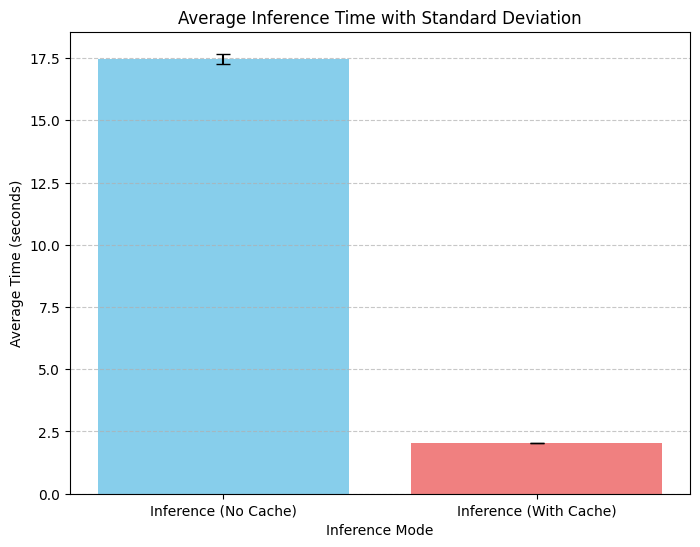
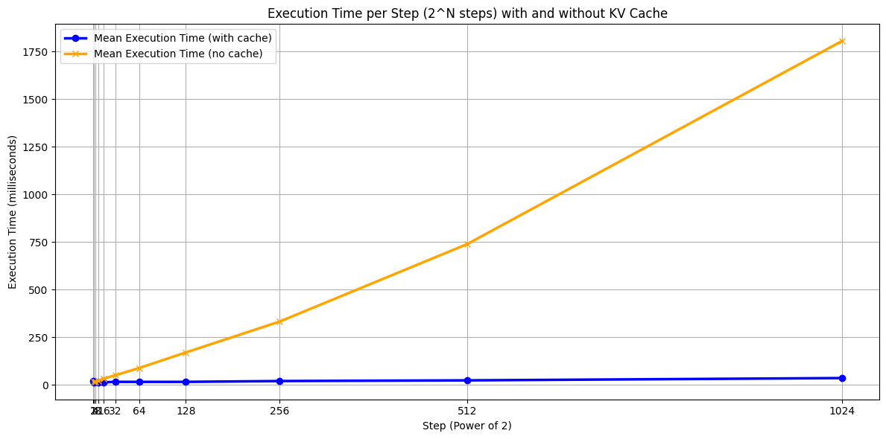
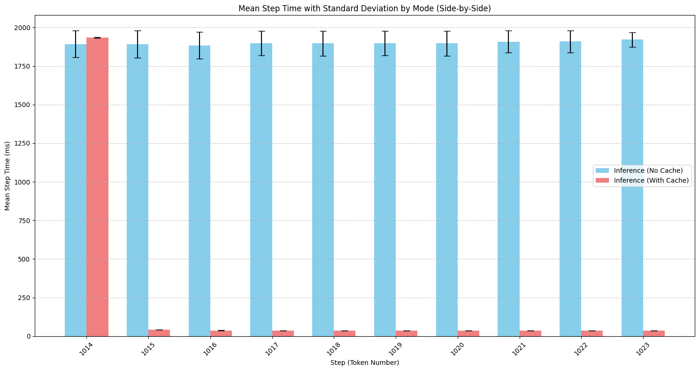
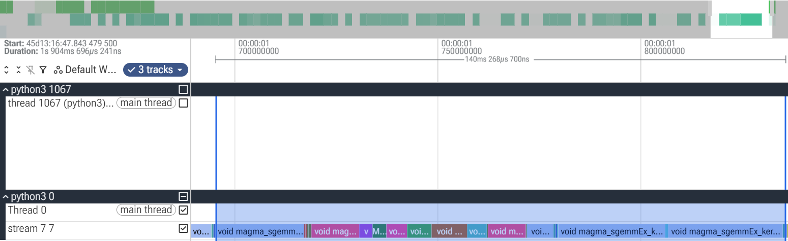
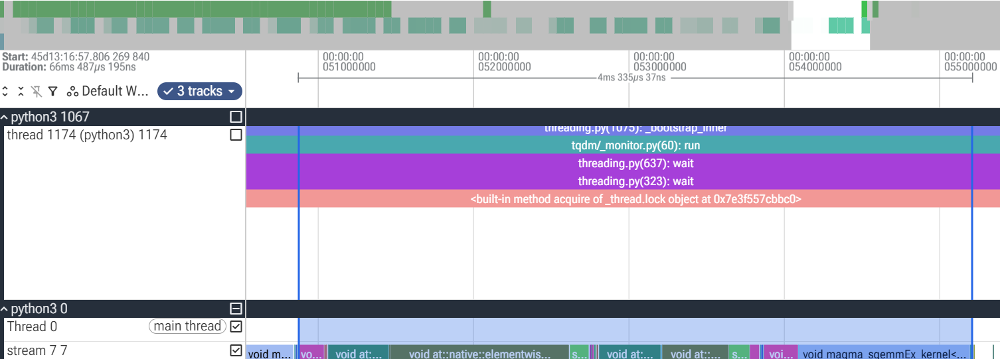
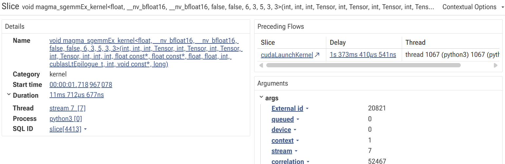
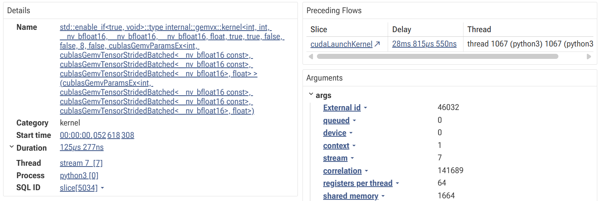
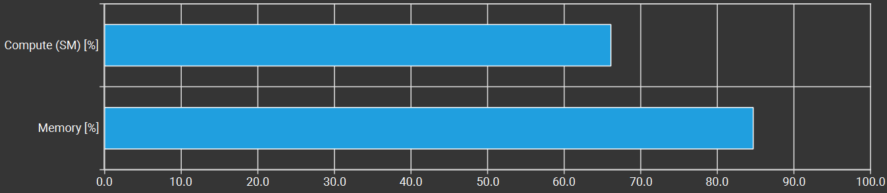

The implementation and experiment code is on [GitHub](https://github.com/winterstar67/model-efficiency-lab/tree/main/KV%20Cache)

# 1. Introduction
In this post, I'll implement KV cache using [nanoGPT](https://github.com/karpathy/nanoGPT), which is small, simple, and clearly implemented.
There are two properties in KV cache:
- Using KV cache makes inference faster than not using it
- The results of token prediction should be the same (But it can't be 100% the same because of floating-point error)

Before I implement KV cache, I had two design options in mind.
1. KV cache for one inference execution:
	- This method is valid only when next token prediction is conducted continuously by reusing the preceding tokens.
	- But when we try to give a new start token or start a new generation, it's hard to reuse the cache.
2. KV cache for several inference executions:
	- This is a more generalized version than the first one.
	- Even if the new start token is given, if that start token is cached, then it can be reused. 

**In this implementation, I chose the first one.**

### Things to check in this post
1. Does applying vs. not applying the KV cache produce the same results?
2. How much does KV cache speed up the inference?

# 2. Implementation
Basically, the concept of KV cache is to save and load the K and V that were calculated in the previous step.
But in the inference situation, we need just the last token. So we can hold just one token not only for the query, but also for every other part such as the input token embedding, the positional embedding, and the FFN (MLP), etc. Not only the execution time of SelfAttention, but also the execution time of other parts can be reduced.
The following are implemented:
1. `running_mode` is added to the forward function in `model.py` 
	- `running_mode == "train"`: this is ignored in this experiment.
	- `running_mode == "inf_cache"`
	- `running_mode == "inf_no_cache"`
	- KV cache is used and the last token of the input is extracted before running the model in `running_mode == "inf_cache"`
2. K and V cache storage
3. Functions to save, load, and reset the K and V cache

# 3. Experiments
## 3-1. KV cache implementation verification
To check whether the implementation is correct, I compared results
- **With vs. Without KV cache**
Both implementations should produce numerically close K and V values and identical predicted token IDs.
### 3-1-1. Settings
```
"batch_size": 3,
"start_token_size": 3,
"max_new_tokens": 13,
"seed": 1337,
"dtype": 'float64',
"compile": False,
"torch.backends.cuda.matmul.allow_tf32": False, # allow tf32 on matmul
"torch.backends.cudnn.allow_tf32": False, # allow tf32 on cudnn
"torch.use_deterministic_algorithms": True
```
Data: [Tiny Shakespeare](https://raw.githubusercontent.com/karpathy/char-rnn/master/data/tinyshakespeare/input.txt)
Model weights: Pretrained GPT-2 parameters from HuggingFace

### 3-1-2. Results of cache and no cache
Start tokens used in the comparison experiment.
1. First data
	- Start text: `First Citizen:`
	- Start tokens: `[5962, 22307, 25]`
2. Second data
	- Start text: `\n Before we`
	- Start tokens: `[198, 8421, 356]`
3. Third data
	- Start text: `proceed any further`
	- Start tokens: `[5120, 597, 2252]`

#### 3-1-2-1. **Token prediction result in the KV cache case:**
```
[inf_cache] step 3: next tokens = [' The', ' get', ' action']
[inf_cache] step 4: next tokens = [' First', ' to', ' against']
[inf_cache] step 5: next tokens = [' Time', ' the', ' the']
[inf_cache] step 6: next tokens = [' You', ' actual', ' company']
[inf_cache] step 7: next tokens = [' Can', ' game', '.']
[inf_cache] step 8: next tokens = [' Play', ',', '\n']
[inf_cache] step 9: next tokens = [' The', ' let', '\n']
[inf_cache] step 10: next tokens = [' First', "'s", 'The']
[inf_cache] step 11: next tokens = [' Time', ' talk', ' company']
[inf_cache] step 12: next tokens = [' You', ' about', ' has']
```
#### 3-1-2-2. **Token prediction result in the no KV cache case:**
```
[inf_no_cache] step 3: next tokens = [' The', ' get', ' action']
[inf_no_cache] step 4: next tokens = [' First', ' to', ' against']
[inf_no_cache] step 5: next tokens = [' Time', ' the', ' the']
[inf_no_cache] step 6: next tokens = [' You', ' actual', ' company']
[inf_no_cache] step 7: next tokens = [' Can', ' game', '.']
[inf_no_cache] step 8: next tokens = [' Play', ',', '\n']
[inf_no_cache] step 9: next tokens = [' The', ' let', '\n']
[inf_no_cache] step 10: next tokens = [' First', "'s", 'The']
[inf_no_cache] step 11: next tokens = [' Time', ' talk', ' company']
[inf_no_cache] step 12: next tokens = [' You', ' about', ' has']
```
**Both implementations produced the same predicted tokens**

#### 3-1-2-3. **Difference between activation and cached values of K and V**
```
# FP32 case
Max K_diff Value: 1.430511474609375e-05 at Layer: 5, Batch: 2, Token: 9
Max V_diff Value: 7.033348083496094e-06 at Layer: 12, Batch: 1, Token: 11
```
- Across every layer, every token, and every tensor of K and V, the maximum differences in fp32 are `1.43e-05` and `7.03e-06`.

```
# FP64 case 
Max K_diff Value: 4.973799150320701e-14 at Layer: 5, Batch: 1, Token: 9
Max V_diff Value: 2.4868995751603507e-14 at Layer: 12, Batch: 1, Token: 5
```
- Across every layer, every token, and every tensor of K and V, the maximum differences in fp64 are `4.97e-14` and `2.49e-14`.

The following are the precisions of fp32 and fp64:
- fp32 epsilon = $2^{-23} ≈ 1.19*10^{-7}$
- fp64 epsilon = $2^{-52} ≈ 2.22*10^{-16}$
- Ratio = $\frac{2^{-52}}{2^{-23}} = 2^{-29} ≈ 1.86*10^{-9}$

By changing `fp32` into `fp64`, the error is also changed approximately into a $10^{-9}$ \~ $10^{-8}$ ratio. Below is the min/max ratio between fp32 and fp64.
```
K_cache: 
  - Max Ratio: 1.4901e-08 at Layer: 1, Batch: 2, Token: 5
  - Min Ratio: 1.0865e-09 at Layer: 8, Batch: 2, Token: 5 
V_cache: 
  - Max Ratio: 1.4901e-08 at Layer: 1, Batch: 1, Token: 10
  - Min Ratio: 1.3767e-09 at Layer: 5, Batch: 3, Token: 6
```
This makes the floating-point error one of the strong candidates that cause this difference.

### 3-1-3. The difference between activation and cached value is not exactly 0 though
Even after using the same dtype and enabling deterministic algorithms, still the difference is not exactly 0. I don't know the exact reason, but maybe it could be because `q,k,v = self.c_attn(x)` is computed with one token in the KV cache case while T tokens are used for `q,k,v` embedding in the no KV cache case or other reasons.
- Still, the start token in fp64 case shows the difference. I couldn't find the reason.

## 3-2. Inference time reduction by KV cache
The main purpose of KV cache is reducing the inference time.
I'll check how much time is reduced compared to not using KV cache

### 3-2-1. Execution time comparison for all tokens
This experiment estimates the wall time from the prefill step to the end of generation including CPU and GPU execution.
**The KV cache shows about the 8.5x faster result in the 1014\~1023 token lengths**
#### 3-2-1-1. Config
```
"batch_size": 16,
"start_token_size": 1014,
"warmup_steps": 10,
"experiment_repeat_times": 10,
"max_new_tokens": 1024,
"seed": 1337,
"device": "cuda",
"dtype": 'bfloat16' if torch.cuda.is_available() and torch.cuda.is_bf16_supported() else 'float16',
"compile": False,
"torch.backends.cuda.matmul.allow_tf32": True, # allow tf32 on matmul
"torch.backends.cudnn.allow_tf32": True, # allow tf32 on cudnn
"torch.use_deterministic_algorithms": False
```
#### 3-2-1-2. No cache result statistics
```
[inf_no_cache] 1014~1023 tokens generation: 
Mean: 17.471 s
Std: 0.205 s
p50 (Median): 17.544 s
Min: 16.911 s
Max: 17.691 s
```
#### 3-2-1-3. Cache result statistics
```
[inf_cache] 1014~1023 tokens generation:
Mean: 2.055 s
Std: 0.003 s
p50 (Median): 2.055 s
Min: 2.052 s
Max: 2.060 s
```


### 3-2-2. Execution time comparison of each token prediction
In each step, the KV cache definitely shows a faster inference speed. The gaps increase as the token length increases.
- **At T=1023, the KV cache shows about the 53x faster result**


- This result is obtained by averaging 15 observations among the 20 repeated executions in each step
	- The first five are not included in the average since they are considered a warm-up

#### 3-2-2-1. No cache result
```
Step | Mean Std p50 p95 p99 Min Max 
-------------------------------------------------------------
1023 | 1920.6ms 48.0ms 1943.4ms 1962.9ms 1965.8ms 1829.6ms 1966.6ms 
```
#### 3-2-2-2. Cache result
```
Step | Mean Std p50 p95 p99 Min Max
------------------------------------------------------------
1023 | 36.4ms 0.2ms 36.3ms 36.8ms 36.9ms 36.2ms 37.0ms
```

- Mean and std of 1014\~1023 tokens. The prefill step (T=1014) has similar execution times.

### 3-2-3. Comparison of execution time of the last Block layer
**At T=1023, the result of applying KV cache shows about 32x faster GPU speed than the no-cache case at the last Block layer.**
`torch.profiler` trace and Perfetto UI were used for analysis
#### 3-2-3-1. No cache result

- 140ms 269$\mu$s at the last Block layer
#### 3-2-3-2. Cache result

- 4ms 335$\mu$s at the last Block layer

### 3-2-4. Comparison of `Q @ K.T` of the last Block layer
**At T=1023, the KV cache case shows about 93x faster matmul kernel speed than the no KV cache case**
#### 3-2-4-1. No Cache result

- 11ms 712$\mu$s
#### 3-2-4-2. Cache result

- 125$\mu$s

# 4. Analysis of `Q @ K.T` kernel speed
## 4-1. Question
For a single autoregressive decoding step at sequence length T, KV cache reduces the attention computation from $O(T^2)$ to $O(T)$. I expected the execution time to be decreased by around 1000x at T=1023, but it shows about a 93x faster result.
Why is the cached one 93x faster than the non-cached one, not 1023x?

## 4-2. Kernel Selection
GEMM is used in the No KV cache case
- GEMM: GEMM reuses the K values, so it doesn't load duplicated data for every element calculation in the result matrix
GEMV is used in the KV cache case
- GEMV: GEMV provides much less data reuse and lower arithmetic intensity than GEMM in `q @ k.T` operation. So it's less efficient than GEMM
GEMV is known as a slower operation than GEMM. This would cause the speedup not to scale linearly.

## 4-3. Memory bound
The KV cache case shows 86.11% memory throughput. This means that the performance is limited by memory bandwidth.
Because GEMV offers limited data reuse and low arithmetic intensity, its performance is often constrained by memory bandwidth.


# 5. Conclusion
Even this naive KV cache improved the inference speed hugely in this short token length, and its benefit is expected to grow as the sequence length increases.

I expect that reducing memory traffic can mitigate the memory bound and increase the speed of KV cache.
- Decreasing the dtype size of the data using quantization.
	- But quantization also decreases the computational bytes. So, there would still be a memory bandwidth bottleneck.
- Using a GPU that has a larger memory bandwidth.

# Reference
- https://huggingface.co/blog/torch-profiler: A good post that introduces `torch.profiler` trace
