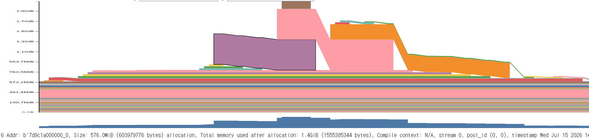

# 1. GPU VRAM debug over time
## 1-1. Tools to run at first

### 1-1-1. `torch.cuda.synchronize()`
If we set `torch.cuda.synchronize()` before the scope of estimation of memory usage, it makes sure that every GPU process before memory checking is done.
If `torch.cuda.synchronize()` is not set, the memory usage of the GPU process before the intended memory usage scope could be captured by the asynchronous property of the GPU process.
So, setting `torch.cuda.synchronize()` is recommended

### 1-1-2. `torch.cuda.reset_peak_memory_stats()`
When we measure memory peak, there's a target range of estimation or a target module to estimate it.
`torch.cuda.reset_peak_memory_stats()` clears the history of memory peak and makes the system start to estimate from that point.
If we don't use `torch.cuda.reset_peak_memory_stats()` and try to measure a memory peak of a certain module, then the other past memory peak could corrupt the measurement.
- Suppose there's history that memory peak was 16GB. But if you measure the memory usage of running module A which takes 3GB, the memory peak would not tell you the memory consumption of module A because the peak would still be 16GB.

### (Optional) 1-1-3. `torch.cuda.empty_cache()`
This function makes just reserved blocks free. For example
```
allocated memory = 4 GB
reserved memory  = 7 GB
```
Becomes
```
allocated memory = 4 GB
reserved memory  ≈ 4 GB
```
If the purpose is to measure `max_memory_allocated()`, then it could be unnecessary.

#### 1-1-3-1. Caution of using `torch.cuda.empty_cache()`
`torch.cuda.empty_cache()` removes the cache which is reserved memory.
If we make this cache free, then when the model is run, there will be extra latency on running the model because allocating GPU memory for data or the other process would be conducted again.

## 1-2. Estimation Tools
### 1-2-1. `torch.cuda.memory_allocated()`
`torch.cuda.memory_allocated()` returns the memory usage at the moment of running this function
Run this right after `torch.cuda.empty_cache()` and `torch.cuda.reset_peak_memory_stats()` code
```
# Example

torch.cuda.empty_cache()
torch.cuda.reset_peak_memory_stats()

baseline_allocated = torch.cuda.memory_allocated()
baseline_reserved = torch.cuda.memory_reserved()

# Run model

return { 
	"baseline_allocated_mb": baseline_allocated / 1024**2,
	"baseline_reserved_mb": baseline_reserved / 1024**2,
	"peak_allocated_mb": torch.cuda.max_memory_allocated() / 1024**2,
	"peak_reserved_mb": torch.cuda.max_memory_reserved() / 1024**2,
	"incremental_peak_allocated_mb": 
		( torch.cuda.max_memory_allocated() - baseline_allocated ) / 1024**2, 
	}
```

### 1-2-2. `torch.cuda.max_memory_allocated()`
`torch.cuda.max_memory_allocated()` returns the peak of memory usage from the start of using GPU or at the point of run `reset_peak_memory_stats()` to the moment of running this function

### 1-2-3. `torch.cuda.memory_reserved()`
`torch.cuda.memory_reserved()` returns the memory usage including cache at the moment of running this function.
- I don't know this function well.
It's always reserved ≥ allocated

### 1-2-4. `torch.cuda.max_memory_reserved()`
This function returns the peak version of `memory_reserved()` like `torch.cuda.max_memory_allocated()` does.

## 1-3. Visualization of memory consumption over time
`cuda.*_memory_*` functions above measure the memory usage at a single point in time. 
Tracking the memory usage over time needs another method.
The code below enables you to track the memory usage
```
torch.cuda.memory._record_memory_history(max_entries=100000)

with ctx:
    logits, loss = model(X, Y)
  torch.cuda.memory._dump_snapshot("/content/drive/MyDrive/Project/nanoGPT/snapshot.pickle")
torch.cuda.memory._record_memory_history(enabled=None)
```

### 1-3-1. `torch.cuda.memory._record_memory_history(max_entries=100000)`
Since this line, every memory allocation/free event is recorded.
- How much bytes are allocated/free
- How much GPU memory usage was at that moment
- Which code line in `model.py` occurred that allocation

`max_entries=100000`: A maximum of 100000 events will be recorded.

Every allocation and free event during the model(X, Y) forward will be recorded
```
with ctx: 
	logits, loss = model(X, Y)
```

### 1-3-2. `torch.cuda.memory._dump_snapshot("snapshot.pickle")`
This function creates a `snapshot.pickle` file that stores the information recorded by `_record_memory_history`.
The visualization is done by uploading this `snapshot.pickle` file to [pytorch memory viz site](https://docs.pytorch.org/memory_viz). Then the form of a graph below would be shown.

- (Example screenshot from a different experiment — shown here just to illustrate the visual format)

### 1-3-3. `torch.cuda.memory._record_memory_history(enabled=None)`
It stops recording the events, which means deactivating `_record_memory_history` function

# 2. Model size estimation
We can estimate the memory usage of a model with simple code
Here's an example code:
```
parameter_bytes = sum(
    p.numel() * p.element_size()
    for p in model.parameters()
)

buffer_bytes = sum(
    b.numel() * b.element_size()
    for b in model.buffers()
)
```

# 3. Situations to analyze: 
- How much GPU memory usage increases as the batch size increases.
	- Check batch_size = 1 case as a baseline and increase it to batch_size=2,3,4,5,6\~
- How much GPU memory do we need for GPT training.
- Figuring out where the OOM error happens. 
- Deciding the batch size for each GPU memory.

# 4. Reference
- PyTorch memory viz analysis: 
	- https://huggingface.co/blog/train_memory
	- https://pytorch.org/blog/understanding-gpu-memory-1/
