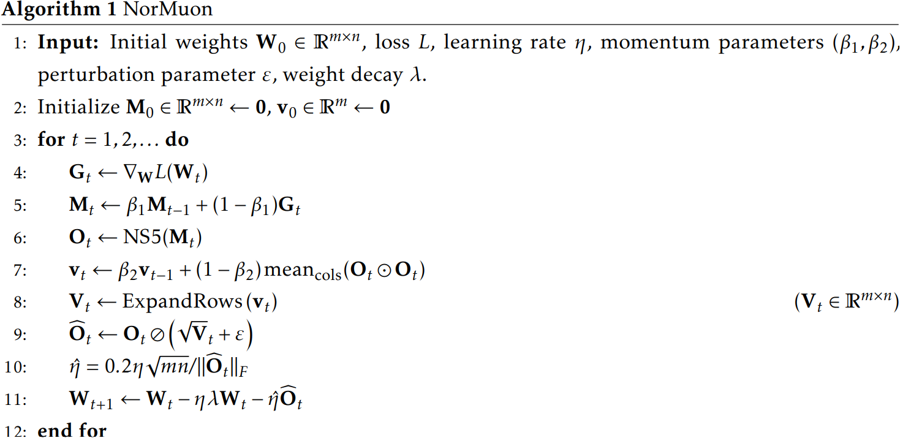

**Note.** The implementation of NorMuon in nanochat is different from [NorMuon paper](https://github.com/zichongli5/NorMuon/blob/main/normuon.py)
- This post is based on the Paper implementation

# 0. Background
- 
	- Muon could be not that clear, probably referring to the  could be better to get the principle.
	- The NorMuon idea is continued from Muon

# 1. Motivation
Muon shows outstanding performance by setting the singular values to 1. But across the row direction(output direction), the magnitude of weight update could be different.
By this, some output weights changed a lot, so large weight could be dominant compared to small weight.
- This means the small weight serves no purpose.

To contribute the impact of each weight evenly, they propose the NorMuon normalization
- **nanochat doesn't fix the normalization axis to be per row, but by designating `red_dim` argument**

# 2. Explanation
The methodology is not that hard, so I'll describe the explanation based on the implementation code(Algorithm)
## 2-1. Algorithm


## 2-2. Code
```
...
# Orthogonalization with singular values=1 (NS iteration) is done
    # NorMuon added
    vnorm = update.norm(dim=(-2,-1), keepdim=True)
    v_mean = torch.mean(update * update, dim=-1, keepdim=True)
    second_momentum.lerp_(v_mean, 1 - beta2)
    step_size = 1 / second_momentum.sqrt().add_(1e-10)
    update.mul_(step_size)
    vnorm_new = update.norm(dim=(-2,-1), keepdim=True)
    update.mul_(vnorm / (vnorm_new.add_(1e-10))) # This scaling keeps the update norm the same as pre-normalization
...
```
- $\hat{O_t}$ in line 9 of algorithm is the same as `update.mul_(step_size)` in the code.
- The role of $\sqrt{mn}$ in line 10 of algorithm corresponds to the `vnorm` in the code.

## 2-3. Why `* (vnorm / vnorm_new)`  exists

In paper, there's the following setence
>We observe that after the row-normalization the resulting direction has a much larger norm. Hence, during the update, we add a learning rate scaling following (Jordan et al., 2024b) to keep a similar RMS norm to match Adam’s RMS norm (line 10).

Suppose we remove `update.mul_(vnorm / (vnorm_new.add_(1e-10)))` term.
1. `second_momentum`: At first, the second momentum is `0`,
2. `second_momentum.lerp_(v_mean, 1 - beta2)`: We update the second momentum with EMA of `v_mean` which is RMS of Muon operation result.
3. `beta2` is `0.95`. So `second_momentum.lerp_(v_mean, 1 - beta2)` = $\beta_2 * 0 + (1-0.95)*v_{mean} = 0.05*v_{mean}$. 
4. `step_size = 1 / second_momentum.sqrt().add_(1e-10)`: Because the second momentum is too low, step_size would be large.
5. `update.mul_(step_size)`: The update value after this code line would be too large by the large step_size
6. The `1/(vnorm_new.add_(1e-10))` can reduce large `update` value. Also, because it's a scalar value, it doesn't hurt the structure of per-neuron normalization
	- `vnorm = update.norm(dim=(-2,-1), keepdim=True)`: `vnorm` is the Frobenius norm before the per-neuron normalization
	- `vnorm_new = update.norm(dim=(-2,-1), keepdim=True)`: `vnorm_new` is the Frobenius norm after per-neuron normalization
- The `* vnorm` can automatically set each parameter not to be too small even if the matrix is big.
	- `vnorm` is almost $\sqrt{min(m,n)}$, because the Frobenius norm of the matrix whose singular values are all set to 1 is same with the square root of rank of that matrix.
	- So, if `update/(vnorm_new.add_(1e-10))` = A, then $||A||_F = 1$. And average parameter value from RMS of matrix A is $\frac{1}{\sqrt{mn}}$. In here, if we multiply `vnorm` = $\sqrt{min(m,n)}$ and considering the `update *= max(1, m/n)**0.5` code, then multiply `vnorm` = $\sqrt{min(m,n)}$ on RMS of A is $\frac{1}{\sqrt{n}}$.
	- `n` means every input into one output. It's natural to reduce or average by the number of input parameters, since each parameter connects one input to one output.
- Also setting the scale into original one can avoid affecting the learning rate impact. What we intended was lr=0.1, but by the scale of the other factors or terms, if there's effect of decreasing the update value by half, then it's almost like changing lr to 0.05.
	- You can refer to  to check the benefit of setting into original one 
