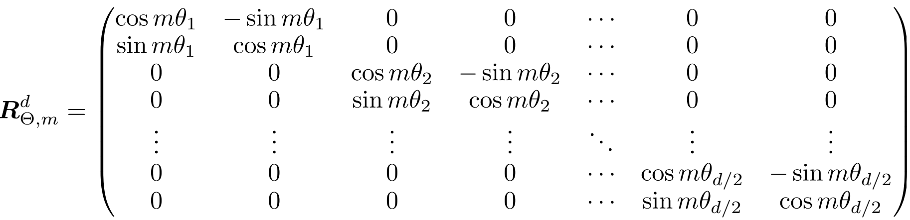
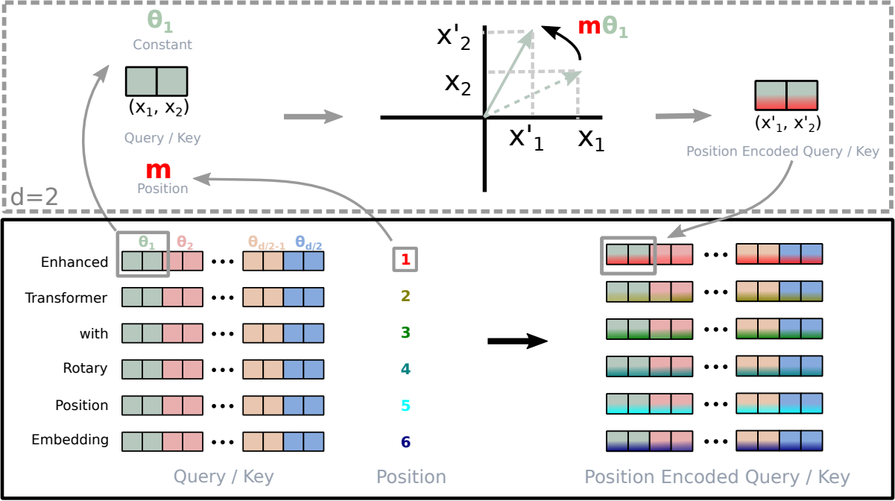

# Paper info
- **Title**: *ROFORMER: ENHANCED TRANSFORMER WITH ROTARY POSITION EMBEDDING*
- **Authors**: Jianlin Su, Yu Lu, Shengfeng Pan, Ahmed Murtadha, Bo Wen, Yunfeng Liu
- **URL** : https://arxiv.org/pdf/2104.09864
- **Length**: 14 pages

# 0. Required mathematics
## 0-1. Linear Algebra 
- Rotation matrix
	- Orthogonal matrix: When the Q is a rotation matrix, then $Q^TQ = I$ 
		- We can interpret this as follows: if the Q is a rotation matrix by angle $\theta$, then the $Q^T$ is a $- \theta$ rotation matrix because when we rotate by multiplying with Q, and when $I$ became identical with original multiplying $Q^T$ - $I$ means that it rotated in the reversed direction with same amount of theta

# 1. Traditional absolute sinusoidal PE
The RNN architecture naturally proceeds each natural language sentence from left to right recursively. This is an inductive bias of RNN. But in transformer, because every word(token) is processed in parallel by a linear layer, there's no property of processing each word in order. Here, Positional embedding gives each token position information which can solve the missed bias of continuity of language(sentence).
- Even for the same word, the embedded vector is not the same when it is in a different position in absolute sinusoidal PE.
- Even for the same words, if the distance between the two tokens is different, then they are in different positions in RoPE

**Absolute sinusoidal PE** is the positional embedding that the transformer architecture proposed. By granting tokens own unique number, there's properties of
1. Distinguish each word at a different index even if there are the same words in a sentence
2. The change of granted position value is continuously increased or decreased

But compared to relative PE, there are some properties of absolute PE which could be debatable.

## 1-1. When the same sentence is in different position
Let's consider these two inputs
1. **I[1] like[2] to[3] run[4] with[5] my[6] cat[7]**
2. `Thesedays[1], the[2] weather[3] is[4] not[5] sunny[6]. It[7] makes[8] me[9] hesitate[10] to[11] run[12] but[13]` **I[14] like[15] to[16] run[17] with[18] my[19] cat[20]**
When we use sin/cos positional embedding from the original Transformer paper, it would distinguish the position for each absolute position of tokens. So, even if there's the same sentence `"I like to run with my cat"`  in both cases, it would not give the same embedding result.
The attention depends on absolute position
- Verb and Object are the patterns that the model running with absolute PE should capture which is not as clear as $R_{j-i}$ in $(W_qx_i)^T R_{j−i}(W_kx_j)$
The distance information is not directly given in absolute PE while RoPE does
- Absolute PE should learn `run` and `my cat` in both index 4 and indices 6,7 and index 17 and indices 19,20

Although it's not dependent on distance like formula "distance 2 is verb and noun", still it would be better than absolute index based learning

## 1-2. Inserting position information at the input layer part not attention weight part
We entrust all information about position at the input layer by allocating unique vectors. The information such as distance between two tokens should be learned during the training not knowing whether the training would learn the distance or not.
- In the equation of $q^T k = x^⊺_m W^⊺_q W_k x_n + x^⊺_m W^⊺_q W_k p_n + p^⊺_m W^⊺_q W_kx_n + p^⊺_m W^⊺_q W_k p_n$, the $p^⊺_m W^⊺_q W_k p_n$ part would get involved in distance learning. But it depends on the training dataset and how the training process goes.

# 2. Rotary Position Embedding
**Rotary Position Embedding(RoPE)** is a method to give each token the information of how far the other tokens are from themselves.
The key formula is $f_{q \text{ or } k}(x_m, m) = R_{\theta, m}^d W_{q \text{ or } k} x_m$ where the $R_{\theta, m}^d$ is a rotation matrix.

- From [the paper](https://arxiv.org/pdf/2104.09864)

Suppose $q = R_{\theta, m}^d W_{q} x_m$ and $k = R_{\theta, n}^d W_{k} x_n$. Then, the relative effect comes from $R_{n-m}$ in $q^T k = x_m^T W_{q}^T R_{\theta, n-m}^d W_k x_n$
- $(R_{\theta, m}^d)^T$ is the same as $(R_{\theta, m}^d)^{-1}$ because it's an orthogonal matrix.
- So if we multiply $R_{\theta, m}^d$ on a vector v which is ($v * R_{\theta, m}^d$), the vector is rotated by the angle of $\theta$. Then, if we multiply $(R_{\theta, m}^d)^T$ on a vector rotated by the angle of $\theta$, which is ($v * R_{\theta, m}^d (R_{\theta, m}^d)^T = v$), we get the original $v$. This means that inverse or transpose matrix has an effect of rotation by the angle of -$\theta$.
So, $R_{\theta, n-m}^d$ is the rotation or relative angle difference between query and key.
Suppose every vector, x,(query and key in RoPE) is at angle 0. In this situation, query is rotated by an angle of $m\theta_1$ and key is rotated by an angle of $n\theta_1$. Now, there's a difference of $n\theta_1 - m\theta_1$
- $m\theta_1$ is minus because the query part is transposed in $q^Tk$ where $q = R_{\theta, m}^d W_{q} x_m$.
This is the part that the RoPE grants a relative expression(The difference of angle) between the query and the key.
- **The relative information would be given after the dot product**. There's no relative information before the dot product. Before the dot product, absolute information is given

- Figure 1 of [the paper](https://arxiv.org/pdf/2104.09864)
## 2-1. Advantages of RoPE
No matter where in the input sequence the sentence appears, the position information among internal tokens in that sentence would not be changed.
Even if the tokens are shifted when the maximum block size is exceeded, the embedding is not changed while the absolute PE should encode again because shifting changes each token's absolute position.

## 2-2. Why the rotation matrix uses 2D unit?
**The following is my own intuition, not the reasoning given in the paper.**
- A 2D rotation matrix is pretty intuitive.
- The rotation matrix more than 2D would require an $n$ x $n$ rotation matrix.
- A pair of two $\theta$ makes more various combinations reducing the probability to be duplicated $[\theta_1, \theta_2, ... , \theta_{\frac{d}{2}}]$ sequence than three or four theta pairs
	- There's the possibility of $\frac{d}{2}$ distinguished elements with pair of two. When d=10, there are five $\theta$s
	- If it's a pair of 5, then it's $\frac{d}{5}$. When d=10, there are two $\theta$s which are less than five, which has a higher possibility that every element has the same angle.

# 3. No definite choice between absolute one and RoPE
Deciding what to choose is dependent on properties that the absolute PE and relative PE have.
With just a few cases above, I can't conclude that RoPE is always better than absolute sinusoidal PE. If the downstream task is always to handle `[Title] - [Date] - [Body text]` formatted text, then absolute sinusoidal PE could be more helpful than RoPE.
But in general, relative positional information gives useful information like the closer one has a higher probability to have high correlation than one that's far away.
