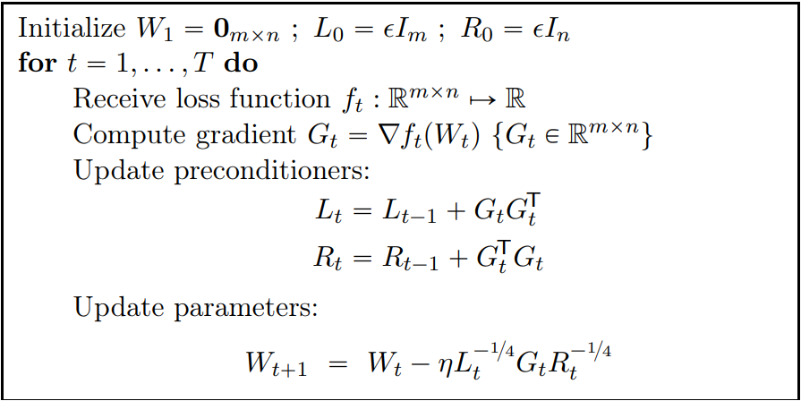
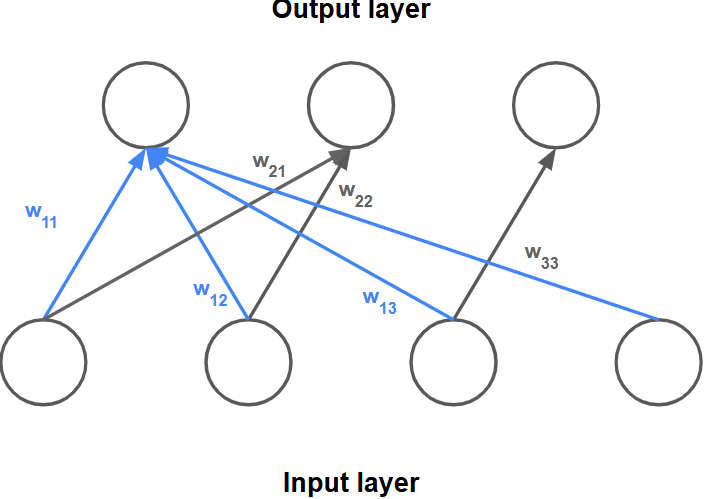
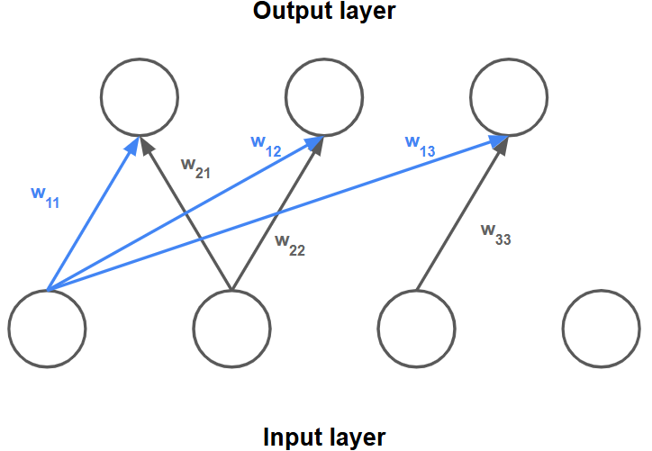

**I didn't read the paper because of too much mathematics**

# Paper info
- **Title**: *Shampoo: Preconditioned Stochastic Tensor Optimization*
- **Authors**: Vineet Gupta, Tomer Koren, Yoram Singer
- **URL** : https://arxiv.org/pdf/1802.09568
- **Length**: 21 pages
	- REFERENCES: 2 pages
	- APPENDIX: 6 pages

# 1. Motivation
## 1-1. Why large-energy directions are dangerous
If one direction repeatedly has large gradients:
- SGD keeps moving strongly there
- may overshoot
- optimization becomes anisotropic
Imagine a narrow and steep valley.

## 1-2. Difference from Adam
- Adam considers every gradient of parameters (update target) as irrelevant to each other.
	- In terms of the degrees of freedom, the direction Adam can scale is only the parameter-axis direction, while diagonal direction or other direction scaling is not possible. 
- Shampoo considers the update pattern across the gradient column and row vectors
	- Shampoo finds the scaling axis which is not restricted to the weight parameter axis based on the row and column gradient vectors (update patterns)
	- In that new direction axis coordinate, there's no relevance to the other axis. So pure scaling is possible without an assumption of independence. Actually, they are independent.

## 1-3. Shampoo's goal
Find the gradient (weight update pattern) independent direction per row and column vectors of the gradient matrix
- Reduce updates along steep/high-energy directions.
- Increase updates along flat/low-energy directions.

# 2. Explanation

## 2-1. Shampoo Algorithm

## 2-2. Weight Matrix (W)
Suppose 
- $W$: Weight matrix whose shape is $m$ x $n$
	- 3 x 4 In this post, $$W = \left(\begin{array}{cccc}w_{11} & w_{12} & w_{13} & w_{14} \\w_{21} & w_{22} & w_{23} & w_{24} \\w_{31} & w_{32} & w_{33} & w_{34} \\\end{array}\right)$$
- G: Gradient matrix of W
	- 3 x 4 In this post,
$$\left(\begin{array}{cccc}g_{11} & g_{12} & g_{13} & g_{14} \\g_{21} & g_{22} & g_{23} & g_{24} \\g_{31} & g_{32} & g_{33} & g_{34} \\\end{array}\right)$$
- $x$: Input vector 
- $y$: Output vector
Then
1. $W[i,j]$: The weight connected to the j-th input node and the i-th output node.
2. i-th row in matrix $W$, $W[1,:]$: Every weight connecting each input node in the current layer to the i-th output node in the next layer.
	- The dimension (direction) of the row vector is the input direction 
	- `[Input1 weight, Input2 weight, ...]`
	- Image of first row
$$\left(\begin{array}{cccc}\textcolor{blue}{w_{11}} & \textcolor{blue}{w_{12}} & \textcolor{blue}{w_{13}} & \textcolor{blue}{w_{14}} \\w_{21} & w_{22} & w_{23} & w_{24} \\w_{31} & w_{32} & w_{33} & w_{34} \\\end{array}\right)$$

3.  j-th column in matrix $W$, $W[:,1]$: Every weight connecting the j-th input node in the current layer to every output node in the next layer.
	- The dimension (direction) of the column vector is the output direction 
	- `First column vector = [Output1 weight, Output2 weight, ...]`
	- Example of first column
$$
\left(
\begin{array}{cccc}
\textcolor{blue}{w_{11}} & w_{12} & w_{13} & w_{14} \\
\textcolor{blue}{w_{21}} & w_{22} & w_{23} & w_{24} \\
\textcolor{blue}{w_{31}} & w_{32} & w_{33} & w_{34}
\end{array}
\right)
$$

## 2-3. Gradient Matrix (G)
- $G[i,j]$: Gradient of loss wrt $W[i,j]$
- i-th row of $G$, $G[i,:]$: Each gradient of the row vector, $W[i,:]$.
	- $G[i,:] = [\frac{dL}{dW[i,1]}, \frac{dL}{dW[i,2]}, \frac{dL}{dW[i,3]}, ...]$
	- We can check whether there's a similar update pattern on a pair of two row vectors
		-  If the update pattern of row1 and row2 is similar, the dot product is high
		- Gradient is used as an update value
		- The dot product is high when each element is similar so the direction is similar by $\cos{\theta}\cdot||v1||\cdot||v2||$
		- Two weight vectors would be changed in a similar direction when we update weights in backpropagation
		- So if the dot product of two vectors is high, we interpret this as the pattern being similar
	- If the matrix is like below,
$$\left(\begin{array}{cccc}\textcolor{blue}{w_{11}} & \textcolor{blue}{w_{12}} & \textcolor{blue}{w_{13}} & \textcolor{blue}{w_{14}} \\w_{21} & w_{22} & w_{23} & w_{24} \\\textcolor{blue}{w_{31}} & \textcolor{blue}{w_{32}} & \textcolor{blue}{w_{33}} & \textcolor{blue}{w_{34}} \\\end{array}\right) \rightarrow \left(\begin{array}{cccc}\textcolor{blue}{0.1} & \textcolor{blue}{0.3} & \textcolor{blue}{-0.1} & \textcolor{blue}{0.2} \\w_{21} & w_{22} & w_{23} & w_{24} \\\textcolor{blue}{0.2} & \textcolor{blue}{0.6} & \textcolor{blue}{-0.2} & \textcolor{blue}{0.4} \\\end{array}\right)$$
then we can say the update patterns of two row gradient vectors are similar

- j-th column of $G$, $G[:,j]$: Each gradient of the column vector, $W[:,j]$.
- Update pattern: Whether the two vectors are similar or not. We can measure the similarity of update pattern with the dot product.

## 2-4. $L=GG^T$
The definition of $L$ includes the addition of $L_{t-1}$ for the accumulation of past gradients too, but I'll drop the $L_{t-1}$ term to focus on the principle.

Suppose $L_{t}=GG^T=\left(\begin{array}{cccc}g_{11} & g_{12} & g_{13} & g_{14} \\g_{21} & g_{22} & g_{23} & g_{24} \\g_{31} & g_{32} & g_{33} & g_{34} \\\end{array}\right) \left(\begin{array}{cccc}g_{11} & g_{21} & g_{31} \\g_{12} & g_{22} & g_{32} \\g_{13} & g_{23} & g_{33} \\ g_{41} & g_{42} & g_{43} \\\end{array}\right) = \left(\begin{array}{cccc}a & b & c \\d & e & f \\g & h & i \\\end{array}\right)$
- $a,b,c,...,i$ are the results of the dot product of each pair of two rows
	- $a$: Dot product of `1st row vector` and `1st row vector`
	- $b$: Dot product of `1st row vector` and `2nd row vector`
	- $c$: Dot product of `1st row vector` and `3rd row vector` 
	- $d$: Dot product of `2nd row vector` and `1st row vector`
	- ...
	- $i$: Dot product of `3rd row vector` and `3rd row vector`
- If the element in L is high, that means the dot product result is high so the directions of two row vectors are similar or the gradient magnitude is large
	- If the direction of two gradient row vectors is similar, that means the weight update pattern of each row in W is similar.

## 2-5. Eigenvector of L

In $L_{t}=GG^T=U\Sigma U^T$, each column vector of $U$ is an eigenvector of $L$

### 2-5-1. Eigenvector indicates the largest output direction among G's column vectors
$$\left(\begin{array}{cccc}\textcolor{blue}{g_{11}} & \textcolor{blue}{g_{12}} & \textcolor{blue}{g_{13}} & \textcolor{blue}{g_{14}} \\g_{21} & g_{22} & g_{23} & g_{24} \\\textcolor{green}{g_{31}} & \textcolor{green}{g_{32}} & \textcolor{green}{g_{33}} & \textcolor{green}{g_{34}} \\\end{array}\right)$$
- Per each column, it shows that the combination of 1st-3rd row components makes the largest gradient energy
	- In $LG = U \Sigma U^T G$, if $u_1^T=[\frac{1}{\sqrt{2}}, 0, \frac{1}{\sqrt{2}}]$,  $u^T_1G$ means the combination of 1st component and 3rd component in each column vector like the figure above - Blue row and Green row

I think it can be applied to a matrix of the $A^TA$ form.
$\text{Var}(Xu) = u^TX^TXu = |Xu|^2$ where mean of $X = 0$ and $u$ is a unit vector. Our purpose is maximizing $Var(Xu)$ by selecting appropriate $u$. So the problem of maximizing $Var(Xu)$ is the same as finding the direction that the variance is maximized
- $Xu$ means we project each row vector of $X$ onto the $u$ vector,
	- $$Xu = \left(\begin{array}{c}X[1,:]\cdot u \\X[2,:]\cdot u \\ X[3,:]\cdot u \\\end{array}\right)$$
	- Because $\cos{\theta}\cdot||u||\cdot||X[i.:]|| = \cos{\theta}\cdot||X[i.:]||$, row of $X$ is projected onto u
- Among the many possible projection directions (many possible values of $u$), which direction to project would maximize the vector length?

Among any arbitrary directions that $u$ can indicate, the $u$ that maximizes the variance $Var(Xu)$ is needed.
At the same time, there's a restriction of $||u||=1$.
To solve this, apply a Lagrange multiplier. Then we get $L=u⊤Σu−λ(u⊤u−1)$. Differentiate it wrt $u$ and set the equation to be 0. Here's the equation $∂L/∂u​=2Σu−2λu=0$.
The $u$ that satisfies the equation is $\Sigma u = \lambda u$. This is the equation of an eigenvector of $\Sigma$.
This means that an eigenvector of $\Sigma$ is the direction that maximizes the variance, and that variance is equal to the eigenvalue

The difference in this Shampoo situation is as follows:
1. It's not variance but gradient magnitude because it doesn't guarantee that the mean is 0
2. $\Sigma$ is mapped to $L$ and $X$ is mapped to $G^T$ in the Shampoo case

Let's interpret it in $LG=U\Sigma U^TG =U\Sigma (U^TG)$
1. We are trying to find the unit vector $u$ that maximizes $u^TGG^Tu = |G^Tu|^2 = u^TLu$ 
2. Maximizing $|G^Tu|^2$ means that we'll project a column vector of $G$ onto a certain $u$ among the many possible directions of $u$. We need the $u$ that maximizes $|G^Tu|^2$ which means the magnitude or length of the column vector in the projected vector in the u-basis.
3. If we find $u$, that means we find the maximum gradient axis to project onto
4. We know that the $u$ that maximizes the length of the projected column vectors is an eigenvector of $GG^T = L$.
5. So when we project $G^T$'s rows, which are column vectors of $G$, onto the $u$ direction, we re-represent the column vector of G into the longest gradient axis.
6. I said $L$ measures the update pattern of gradient column vectors (one input to several outputs).
	- The role of $u$ is a combinator of component inside column vector = $[output1, output2, ...]$, so if the projected gradient length is maximized at $u=[$$\frac{1}{\sqrt{2}}$,0,$\frac{1}{\sqrt{2}}]$, then that means when we combine output1 and output3 at each input element, that direction of projection maximizes the gradient length - if we combine these components with these ratios, then it's the direction that has largest gradient magnitude
$$
G^Tu = \left(\begin{array}{ccc}\textcolor{blue}{g_{11}} & g_{21} & \textcolor{green}{g_{31}} \\\textcolor{blue}{g_{12}} & g_{22} & \textcolor{green}{g_{32}} \\ \textcolor{blue}{g_{13}} & g_{23} & \textcolor{green}{g_{33}} \\ \textcolor{blue}{g_{41}} & g_{42} & \textcolor{green}{g_{43}} \\\end{array}\right)
=(u^TG)^T = 
\left(
\begin{array}{cccc}
\textcolor{blue}{g_{11}} & \textcolor{blue}{g_{12}} & \textcolor{blue}{g_{13}} & \textcolor{blue}{g_{14}} \\
g_{21} & g_{22} & g_{23} & g_{24} \\
\textcolor{green}{g_{31}} & \textcolor{green}{g_{32}} & \textcolor{green}{g_{33}} & \textcolor{green}{g_{34}}
\end{array}
\right)^T
$$
- Also we can interpret an eigenvector in terms of L
	- $u^TLu$ = $\sum_{j=1}^m{u_j\cdot(\sum_{i=1}^m{L[j,i]\cdot u_i})}$, $u$ indicates that the sum of gradient (weight update pattern) for every pair of two vectors is the largest

The point:
- We got the reason why we should project a column vector of $G$ onto an eigenvector of $L$, not a row vector of $G$. That's the natural purpose from the start of the proof
- Why an eigenvector is the largest direction

## 2-6. Projection onto eigenvector $u$
### 2-6-1. Why $u^TG$ or $G^Tu$ means projecting a column vector of G onto u
If we take the dot product of a unit vector $u$ and a vector $x$, then the vector $x$ will be projected onto the direction of $u$
- Each row of $U^T$ is an eigenvector of $L$ 
- $U^TG_{:,1}$ operates the dot product of the 1st column of G and each eigenvector of U, in other words,  $G_{:,1}$ is projected onto the eigenvectors of $U^T$, so $G_{:,1}$ is re-represented in the U-basis but the vectors before and after projection are the same
	- The dot product is $\cos{\theta} \cdot ||u|| \cdot ||G_{:,1}|| = \cos{\theta}\cdot||G_{:,1}||$ ($\theta$ is the angle between $u$ and $G_{:,1}$)
	- $U^TG_{:,1}=\begin{bmatrix}  u_1G_{:,1} \\ u_2G_{:,1} \\ u_3G_{:,1}  \end{bmatrix}$, $G_{:,1}$ is projected onto each eigenvector direction

## 2-7. The effect of multiplying $L=U \Sigma U^T$
I'll check the effect of multiplying $G$ by $L=U\Sigma U^T$ in the order $U^TG$, $\Sigma (U^TG)$, and $U (\Sigma U^TG)$.
- $U^T G$: This operation has two effects
	1. Projecting the column vectors of the gradient matrix and re-representing them in the U-basis, whose first axis is the direction of the largest gradient.
	2. The scaled components are independent. For example, suppose that the first eigenvector is a combinator of col1 and col3 vectors in the G matrix (which means that combination of col1 and col3 shows similar update pattern and the largest gradient norm value - this result depends on the specific data sample; it is not a deterministic outcome). We will scale the gradient on that eigenvector1 direction which means for every gradient column vector, we'll apply that rule, eigenvector1 direction scaling
		- And when we scale the gradient in this unit (scaling in each projection axis), the scaling does not affect the gradient scale of the other axes. 
		- Scaling each target does not affect the other scaling targets. 
			- eigenvector1 means the largest gradient vector combination direction based on current data. Then we project every gradient column vector onto that eigenvector1 direction and apply the scaling to the components along that direction.
	
- $\Sigma (U^TG)$ : Scaling $(U^TG)$ by the factor matrix $\Sigma$ in the U-basis.
	- Unlike the original standard axis, the scaling on one axis does not affect the other axis's scaling. Now each scaling target is independent of each other.
		- Adam assumed the off-diagonal of $GG^T$ is 0, even if that's not 0. But in the Shampoo optimizer, now each scaling target is actually 0.
	- The scaling target for one scaling factor is a row of $U^T G$, or one eigenvector direction
	- Each row of $U^TG$ means projecting each column vector onto the direction of each eigenvector.
- $U (\Sigma U^TG)$: Invert the scaled and projected vectors into the original standard basis space by multiplying $(\Sigma U^TG)$ with $U$
	- Interpretation 1: $U^T$ and $U$ are inverses of each other. So this can be interpreted as restoring $(\Sigma U^TG)$ back to the basis space
	- Interpretation 2: the rotation matrix U rotates the space by an angle of $\theta$. Inversely, $U^T$ rotates the space by the angle of $-\theta$.

- $U^T G$:
	- $U^T$: Each row vector is an eigenvector of $L$
	- G: Each column vector consists of gradient (weight pattern) of weight from j-th input to (output 1, output 2, ..., output m)
	- Each $U^T G$'s column is the projection of the column vector of G onto the new coordinate whose axes are eigenvectors